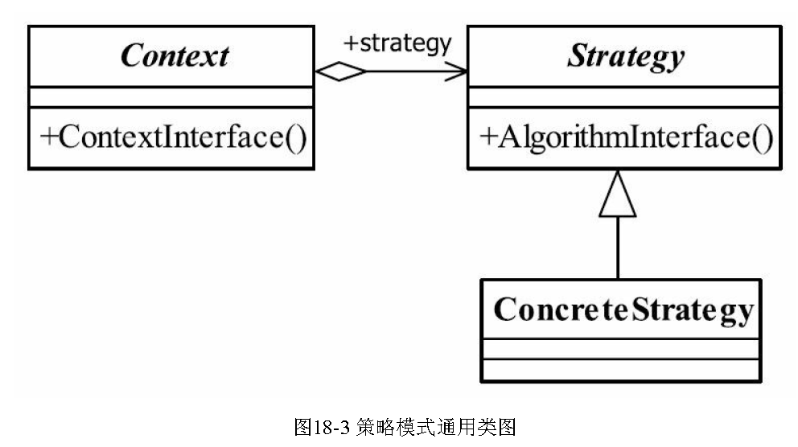

## 策略模式
---
* 定义：定义一组算法，将每个算法都封装起来，使之可以互相转换。
* UML类图：

* 举例：赔了夫人又折兵：赵云-client，锦囊-coontext，三个妙计-concrete strategy，
* context封装角色
    * 屏蔽高层对策略和算法的直接访问，封装可能存在的变化
* Strategy抽象策略角色
    * 策略、算法家族的抽象，通常为接口，定义每个策略或算法必须具有的方法和属性
* ConcreteStrategy具体策略角色
    * 实现抽象策略中的具体操作/算法。
* 代码
```java
public interface Strategy {
	
	//策略模式的运算法则
	public void doSomething();
}

public class ConcreteStrategy1 implements Strategy {

	public void doSomething() {
		System.out.println("具体策略1的运算法则");
	}

}

public class ConcreteStrategy2 implements Strategy {

	public void doSomething() {
		System.out.println("具体策略2的运算法则");
	}

}

public class Context {
	//抽象策略
	private Strategy strategy = null;
	
	//构造函数设置具体策略
	public Context(Strategy _strategy){
		this.strategy = _strategy;
	}
	
	//封装后的策略方法
	public void doAnythinig(){
		this.strategy.doSomething();
	}
}

public class Client {
	
	public static void main(String[] args) {
		//声明出一个具体的策略
		Strategy strategy = new ConcreteStrategy1(); 
		//声明出上下文对象
		Context context = new Context(strategy);
		//执行封装后的方法
		context.doAnythinig();
	}
	
	
}
```

* 策略模式的重点就是封装角色，它是借用了代理模式的思路，它和代理
模式的差别就是策略模式的封装角色和被封装的策略类不用是同一个接口，如果
是同一个接口那就成为了代理模式

* 优点
    * 算法之间自由切换
    * 避免使用多重判断
    * 扩展性好：增加一个策略只需要实现接口。

* 缺点
    * 策略类多而且基本不能复用
    * 策略类都要对外暴露

* 使用场景
    * 多个类只有算法和行为稍有不同
    * 算法需要自由切换
    * 需要屏蔽算法规则：算法太多的时候只需要记住名字就好

* 注意事项
    * 如果系统中的一个策略家族的具体策略数量超过4个，则需要考虑使用混合模式，解决
策略类膨胀和对外暴露的问题，否则日后的系统维护就会成为一个烫手山芋
* 例子
    * 输入a,b,和string（+/-）进行计算