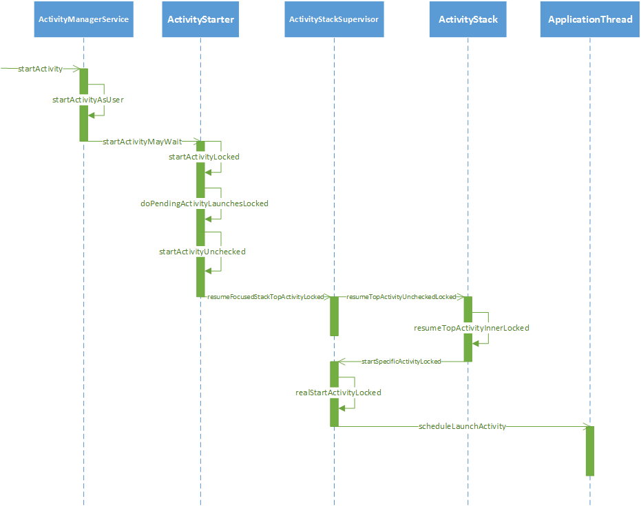
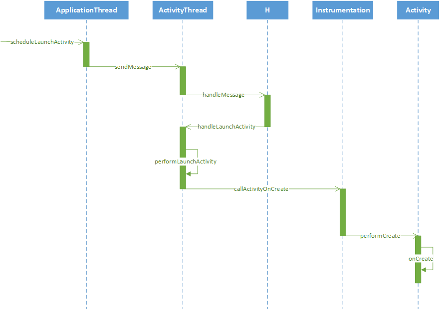

从调用activty.startActivity(intent)方法开始：
```java
    @Override
    public void startActivity(Intent intent) {
        this.startActivity(intent, null);
    }
```
可以看到调了这个方法：
```java
    @Override
    public void startActivity(Intent intent, @Nullable Bundle options) {
        if (options != null) {
            startActivityForResult(intent, -1, options);
        } else {
            // Note we want to go through this call for compatibility with
            // applications that may have overridden the method.
            startActivityForResult(intent, -1);
        }
    }
```
这里需要注意传入的request_code为-1，只有>=0才会从onActivityResult()返回。
再接着看，又调用了：
```java
    public void startActivityForResult(@RequiresPermission Intent intent, int requestCode,
            @Nullable Bundle options) {
        if (mParent == null) {
            options = transferSpringboardActivityOptions(options);
            Instrumentation.ActivityResult ar =
                mInstrumentation.execStartActivity(
                    this, mMainThread.getApplicationThread(), mToken, this,
                    intent, requestCode, options);
            if (ar != null) {
                mMainThread.sendActivityResult(
                    mToken, mEmbeddedID, requestCode, ar.getResultCode(),
                    ar.getResultData());
            }
            if (requestCode >= 0) {
                // If this start is requesting a result, we can avoid making
                // the activity visible until the result is received.  Setting
                // this code during onCreate(Bundle savedInstanceState) or onResume() will keep the
                // activity hidden during this time, to avoid flickering.
                // This can only be done when a result is requested because
                // that guarantees we will get information back when the
                // activity is finished, no matter what happens to it.
                mStartedActivity = true;
            }

            cancelInputsAndStartExitTransition(options);
            // TODO Consider clearing/flushing other event sources and events for child windows.
        } else {
            if (options != null) {
                mParent.startActivityFromChild(this, intent, requestCode, options);
            } else {
                // Note we want to go through this method for compatibility with
                // existing applications that may have overridden it.
                mParent.startActivityFromChild(this, intent, requestCode);
            }
        }
    }
```
mParent为我们当前activity的父activity（embedded inside关系），这里一般为null，所以进而调用Instrumentation类的execStartActivity方法：
```java
    /**
     *
     * @param who The Context from which the activity is being started.
     * @param contextThread The main thread of the Context from which the activity
     *                      is being started.
     * @param token Internal token identifying to the system who is starting 
     *              the activity; may be null.
     * @param target Which activity is performing the start (and thus receiving 
     *               any result); may be null if this call is not being made
     *               from an activity.
     * @param intent The actual Intent to start.
     * @param requestCode Identifier for this request's result; less than zero 
     *                    if the caller is not expecting a result.
     * @param options Addition options.
     *
     * @return To force the return of a particular result, return an 
     *         ActivityResult object containing the desired data; otherwise
     *         return null.  The default implementation always returns null.
     *
     * @throws android.content.ActivityNotFoundException
     *
     * @see Activity#startActivity(Intent)
     * @see Activity#startActivityForResult(Intent, int)
     * @see Activity#startActivityFromChild
     *
     * {@hide}
     */
    public ActivityResult execStartActivity(
            Context who, IBinder contextThread, IBinder token, Activity target,
            Intent intent, int requestCode, Bundle options) {
        IApplicationThread whoThread = (IApplicationThread) contextThread;
        Uri referrer = target != null ? target.onProvideReferrer() : null;
        if (referrer != null) {
            intent.putExtra(Intent.EXTRA_REFERRER, referrer);
        }
        if (mActivityMonitors != null) {
            synchronized (mSync) {
                final int N = mActivityMonitors.size();
                for (int i=0; i<N; i++) {
                    final ActivityMonitor am = mActivityMonitors.get(i);
                    if (am.match(who, null, intent)) {
                        am.mHits++;
                        //当该monitor阻塞activity启动,则直接返回
                        if (am.isBlocking()) {
                            return requestCode >= 0 ? am.getResult() : null;
                        }
                        break;
                    }
                }
            }
        }
        try {
            intent.migrateExtraStreamToClipData();
            intent.prepareToLeaveProcess(who);
            int result = ActivityManagerNative.getDefault()
                .startActivity(whoThread, who.getBasePackageName(), intent,
                        intent.resolveTypeIfNeeded(who.getContentResolver()),
                        token, target != null ? target.mEmbeddedID : null,
                        requestCode, 0, null, options);
            checkStartActivityResult(result, intent);
        } catch (RemoteException e) {
            throw new RuntimeException("Failure from system", e);
        }
        return null;
    }
```
进而通过`ActivityManagerNative.getDefault()`返回的对象启动activity
```java
    /**
     * Retrieve the system's default/global activity manager.
     */
    static public IActivityManager getDefault() {
        return gDefault.get();
    }
```
gDefault是个singleTon,get()返回其泛型类型的单例。
```java
    private static final Singleton<IActivityManager> gDefault = new Singleton<IActivityManager>() {
        protected IActivityManager create() {
            IBinder b = ServiceManager.getService("activity");
            if (false) {
                Log.v("ActivityManager", "default service binder = " + b);
            }
            IActivityManager am = asInterface(b);
            if (false) {
                Log.v("ActivityManager", "default service = " + am);
            }
            return am;
        }
    };
```
可见这里是利用ipc获取到`ActivityManagerProxy`，进而调用其`startActivity`方法：
```java
class ActivityManagerProxy implements IActivityManager
{
    public ActivityManagerProxy(IBinder remote)
    {
        mRemote = remote;
    }

    public IBinder asBinder()
    {
        return mRemote;
    }

    public int startActivity(IApplicationThread caller, String callingPackage, Intent intent,
            String resolvedType, IBinder resultTo, String resultWho, int requestCode,
            int startFlags, ProfilerInfo profilerInfo, Bundle options) throws RemoteException {
        Parcel data = Parcel.obtain();
        Parcel reply = Parcel.obtain();
        data.writeInterfaceToken(IActivityManager.descriptor);
        data.writeStrongBinder(caller != null ? caller.asBinder() : null);
        data.writeString(callingPackage);
        intent.writeToParcel(data, 0);
        data.writeString(resolvedType);
        data.writeStrongBinder(resultTo);
        data.writeString(resultWho);
        data.writeInt(requestCode);
        data.writeInt(startFlags);
        if (profilerInfo != null) {
            data.writeInt(1);
            profilerInfo.writeToParcel(data, Parcelable.PARCELABLE_WRITE_RETURN_VALUE);
        } else {
            data.writeInt(0);
        }
        if (options != null) {
            data.writeInt(1);
            options.writeToParcel(data, 0);
        } else {
            data.writeInt(0);
        }
        mRemote.transact(START_ACTIVITY_TRANSACTION, data, reply, 0);
        reply.readException();
        int result = reply.readInt();
        reply.recycle();
        data.recycle();
        return result;
    }
    ......
}
```
执行到这里`ActivityManagerProxy`又作为client利用底层的binder driver向`ActivityManagerService`(server)传输数据，注意Binder机制是单向的，是异步的。

再来看`ActivityManagerService`的startActivity方法：
```java
    @Override
    public final int startActivity(IApplicationThread caller, String callingPackage,
            Intent intent, String resolvedType, IBinder resultTo, String resultWho, int requestCode,
            int startFlags, ProfilerInfo profilerInfo, Bundle bOptions) {
        return startActivityAsUser(caller, callingPackage, intent, resolvedType, resultTo,
                resultWho, requestCode, startFlags, profilerInfo, bOptions,
                UserHandle.getCallingUserId());
    }
```
直接调用了`startActivityAsUser`:
```java
    @Override
    public final int startActivityAsUser(IApplicationThread caller, String callingPackage,
            Intent intent, String resolvedType, IBinder resultTo, String resultWho, int requestCode,
            int startFlags, ProfilerInfo profilerInfo, Bundle bOptions, int userId) {
        enforceNotIsolatedCaller("startActivity");
        userId = mUserController.handleIncomingUser(Binder.getCallingPid(), Binder.getCallingUid(),
                userId, false, ALLOW_FULL_ONLY, "startActivity", null);
        // TODO: Switch to user app stacks here.
        return mActivityStarter.startActivityMayWait(caller, -1, callingPackage, intent,
                resolvedType, null, null, resultTo, resultWho, requestCode, startFlags,
                profilerInfo, null, null, bOptions, false, userId, null, null);
    }
```
接着调用了`ActivityStarter`的`StartActivityMayWait`方法：
```java
final int startActivityMayWait(IApplicationThread caller, int callingUid,
            String callingPackage, Intent intent, String resolvedType,
            IVoiceInteractionSession voiceSession, IVoiceInteractor voiceInteractor,
            IBinder resultTo, String resultWho, int requestCode, int startFlags,
            ProfilerInfo profilerInfo, IActivityManager.WaitResult outResult, Configuration config,
            Bundle bOptions, boolean ignoreTargetSecurity, int userId,
            IActivityContainer iContainer, TaskRecord inTask) {
            ......
            int res = startActivityLocked(caller, intent, ephemeralIntent, resolvedType,
                    aInfo, rInfo, voiceSession, voiceInteractor,
                    resultTo, resultWho, requestCode, callingPid,
                    callingUid, callingPackage, realCallingPid, realCallingUid, startFlags,
                    options, ignoreTargetSecurity, componentSpecified, outRecord, container,
                    inTask);
            ......
            return res;
        }
    }
```
可以看到`startActivityMayWait`方法接着调用了`startActivityLocked`方法，而`startActivityLocked`又调用了`doPendingActivityLaunchesLocked`，三个方法都是`ActivityStarter`的方法:
```java
final int startActivityLocked(IApplicationThread caller, Intent intent, Intent ephemeralIntent,
            String resolvedType, ActivityInfo aInfo, ResolveInfo rInfo,
            IVoiceInteractionSession voiceSession, IVoiceInteractor voiceInteractor,
            IBinder resultTo, String resultWho, int requestCode, int callingPid, int callingUid,
            String callingPackage, int realCallingPid, int realCallingUid, int startFlags,
            ActivityOptions options, boolean ignoreTargetSecurity, boolean componentSpecified,
            ActivityRecord[] outActivity, ActivityStackSupervisor.ActivityContainer container,
            TaskRecord inTask) {
        ......
        doPendingActivityLaunchesLocked(false);
        ......
    }
```
`doPendingActivityLaunchesLocked`又调用了`startActivityUnchecked`：
```java
    final void doPendingActivityLaunchesLocked(boolean doResume) {
        while (!mPendingActivityLaunches.isEmpty()) {
            final PendingActivityLaunch pal = mPendingActivityLaunches.remove(0);
            final boolean resume = doResume && mPendingActivityLaunches.isEmpty();
            try {
                final int result = startActivityUnchecked(
                        pal.r, pal.sourceRecord, null, null, pal.startFlags, resume, null, null);
                postStartActivityUncheckedProcessing(
                        pal.r, result, mSupervisor.mFocusedStack.mStackId, mSourceRecord,
                        mTargetStack);
            } catch (Exception e) {
                Slog.e(TAG, "Exception during pending activity launch pal=" + pal, e);
                pal.sendErrorResult(e.getMessage());
            }
        }
    }
```
`startActivityUnchecked`又调用了` mSupervisor.resumeFocusedStackTopActivityLocked();`
```java
    private int startActivityUnchecked(final ActivityRecord r, ActivityRecord sourceRecord,
            IVoiceInteractionSession voiceSession, IVoiceInteractor voiceInteractor,
            int startFlags, boolean doResume, ActivityOptions options, TaskRecord inTask) {

        setInitialState(r, options, inTask, doResume, startFlags, sourceRecord, voiceSession,
                voiceInteractor);

        computeLaunchingTaskFlags();

        computeSourceStack();

        mIntent.setFlags(mLaunchFlags);

        mReusedActivity = getReusableIntentActivity();

        final int preferredLaunchStackId =
                (mOptions != null) ? mOptions.getLaunchStackId() : INVALID_STACK_ID;

        if (mReusedActivity != null) {
            // When the flags NEW_TASK and CLEAR_TASK are set, then the task gets reused but
            // still needs to be a lock task mode violation since the task gets cleared out and
            // the device would otherwise leave the locked task.
            if (mSupervisor.isLockTaskModeViolation(mReusedActivity.task,
                    (mLaunchFlags & (FLAG_ACTIVITY_NEW_TASK | FLAG_ACTIVITY_CLEAR_TASK))
                            == (FLAG_ACTIVITY_NEW_TASK | FLAG_ACTIVITY_CLEAR_TASK))) {
                mSupervisor.showLockTaskToast();
                Slog.e(TAG, "startActivityUnchecked: Attempt to violate Lock Task Mode");
                return START_RETURN_LOCK_TASK_MODE_VIOLATION;
            }

            if (mStartActivity.task == null) {
                mStartActivity.task = mReusedActivity.task;
            }
            if (mReusedActivity.task.intent == null) {
                // This task was started because of movement of the activity based on affinity...
                // Now that we are actually launching it, we can assign the base intent.
                mReusedActivity.task.setIntent(mStartActivity);
            }

            // This code path leads to delivering a new intent, we want to make sure we schedule it
            // as the first operation, in case the activity will be resumed as a result of later
            // operations.
            if ((mLaunchFlags & FLAG_ACTIVITY_CLEAR_TOP) != 0
                    || mLaunchSingleInstance || mLaunchSingleTask) {
                // In this situation we want to remove all activities from the task up to the one
                // being started. In most cases this means we are resetting the task to its initial
                // state.
                final ActivityRecord top = mReusedActivity.task.performClearTaskForReuseLocked(
                        mStartActivity, mLaunchFlags);
                if (top != null) {
                    if (top.frontOfTask) {
                        // Activity aliases may mean we use different intents for the top activity,
                        // so make sure the task now has the identity of the new intent.
                        top.task.setIntent(mStartActivity);
                    }
                    ActivityStack.logStartActivity(AM_NEW_INTENT, mStartActivity, top.task);
                    top.deliverNewIntentLocked(mCallingUid, mStartActivity.intent,
                            mStartActivity.launchedFromPackage);
                }
            }

            sendPowerHintForLaunchStartIfNeeded(false /* forceSend */);

            mReusedActivity = setTargetStackAndMoveToFrontIfNeeded(mReusedActivity);

            if ((mStartFlags & START_FLAG_ONLY_IF_NEEDED) != 0) {
                // We don't need to start a new activity, and the client said not to do anything
                // if that is the case, so this is it!  And for paranoia, make sure we have
                // correctly resumed the top activity.
                resumeTargetStackIfNeeded();
                return START_RETURN_INTENT_TO_CALLER;
            }
            setTaskFromIntentActivity(mReusedActivity);

            if (!mAddingToTask && mReuseTask == null) {
                // We didn't do anything...  but it was needed (a.k.a., client don't use that
                // intent!)  And for paranoia, make sure we have correctly resumed the top activity.
                resumeTargetStackIfNeeded();
                return START_TASK_TO_FRONT;
            }
        }

        if (mStartActivity.packageName == null) {
            if (mStartActivity.resultTo != null && mStartActivity.resultTo.task.stack != null) {
                mStartActivity.resultTo.task.stack.sendActivityResultLocked(
                        -1, mStartActivity.resultTo, mStartActivity.resultWho,
                        mStartActivity.requestCode, RESULT_CANCELED, null);
            }
            ActivityOptions.abort(mOptions);
            return START_CLASS_NOT_FOUND;
        }

        // If the activity being launched is the same as the one currently at the top, then
        // we need to check if it should only be launched once.
        final ActivityStack topStack = mSupervisor.mFocusedStack;
        final ActivityRecord top = topStack.topRunningNonDelayedActivityLocked(mNotTop);
        final boolean dontStart = top != null && mStartActivity.resultTo == null
                && top.realActivity.equals(mStartActivity.realActivity)
                && top.userId == mStartActivity.userId
                && top.app != null && top.app.thread != null
                && ((mLaunchFlags & FLAG_ACTIVITY_SINGLE_TOP) != 0
                || mLaunchSingleTop || mLaunchSingleTask);
        if (dontStart) {
            ActivityStack.logStartActivity(AM_NEW_INTENT, top, top.task);
            // For paranoia, make sure we have correctly resumed the top activity.
            topStack.mLastPausedActivity = null;
            if (mDoResume) {
                mSupervisor.resumeFocusedStackTopActivityLocked();
            }
            ActivityOptions.abort(mOptions);
            if ((mStartFlags & START_FLAG_ONLY_IF_NEEDED) != 0) {
                // We don't need to start a new activity, and the client said not to do
                // anything if that is the case, so this is it!
                return START_RETURN_INTENT_TO_CALLER;
            }
            //直接复用栈顶activity，调用onNewIntent()
            top.deliverNewIntentLocked(
                    mCallingUid, mStartActivity.intent, mStartActivity.launchedFromPackage);

            // Don't use mStartActivity.task to show the toast. We're not starting a new activity
            // but reusing 'top'. Fields in mStartActivity may not be fully initialized.
            mSupervisor.handleNonResizableTaskIfNeeded(
                    top.task, preferredLaunchStackId, topStack.mStackId);

            return START_DELIVERED_TO_TOP;
    }
```
`ActivityStackSupervisor`主要负责管理`ActivityStack`和`ActivityRecord`，`TaskRecord`。
```java
    /** The stack containing the launcher app. Assumed to always be attached to
     * Display.DEFAULT_DISPLAY. */
    ActivityStack mHomeStack;

    /** The stack currently receiving input or launching the next activity. */
    ActivityStack mFocusedStack;

    /** If this is the same as mFocusedStack then the activity on the top of the focused stack has
     * been resumed. If stacks are changing position this will hold the old stack until the new
     * stack becomes resumed after which it will be set to mFocusedStack. */
    private ActivityStack mLastFocusedStack;

     /** List of activities that are ready to be stopped, but waiting for the next activity to
     * settle down before doing so. */
    final ArrayList<ActivityRecord> mStoppingActivities = new ArrayList<>();

    /** List of activities that are ready to be finished, but waiting for the previous activity to
     * settle down before doing so.  It contains ActivityRecord objects. */
    final ArrayList<ActivityRecord> mFinishingActivities = new ArrayList<>();

    /** List of activities that are in the process of going to sleep. */
    final ArrayList<ActivityRecord> mGoingToSleepActivities = new ArrayList<>();

    /** List of activities whose multi-window mode changed that we need to report to the
     * application */
    final ArrayList<ActivityRecord> mMultiWindowModeChangedActivities = new ArrayList<>();

    /** List of activities whose picture-in-picture mode changed that we need to report to the
     * application */
    final ArrayList<ActivityRecord> mPipModeChangedActivities = new ArrayList<>();

    /** The chain of tasks in lockTask mode. The current frontmost task is at the top, and tasks
     * may be finished until there is only one entry left. If this is empty the system is not
     * in lockTask mode. */
    ArrayList<TaskRecord> mLockTaskModeTasks = new ArrayList<>();
```
其`resumeFocusedStackTopActivityLocked()`源码如下：
```java
    boolean resumeFocusedStackTopActivityLocked() {
        return resumeFocusedStackTopActivityLocked(null, null, null);
    }

    boolean resumeFocusedStackTopActivityLocked(
            ActivityStack targetStack, ActivityRecord target, ActivityOptions targetOptions) {
        if (targetStack != null && isFocusedStack(targetStack)) {
            return targetStack.resumeTopActivityUncheckedLocked(target, targetOptions);
        }
        final ActivityRecord r = mFocusedStack.topRunningActivityLocked();
        if (r == null || r.state != RESUMED) {
            mFocusedStack.resumeTopActivityUncheckedLocked(null, null);
        }
        return false;
    }
```
又调用了`ActivityStack`类型`mFocusedStack`的`resumeTopActivityUncheckedLocked`方法,`resumeTopActivityUncheckedLocked`又调用了`resumeTopActivityInnerLocked`，`resumeTopActivityInnerLocked`又调用了`mStackSupervisor.startSpecificActivityLocked(next, true, false);`。
`startSpecificActivityLocked`源码如下：
```java
    void startSpecificActivityLocked(ActivityRecord r,
            boolean andResume, boolean checkConfig) {
        // Is this activity's application already running?
        ProcessRecord app = mService.getProcessRecordLocked(r.processName,
                r.info.applicationInfo.uid, true);

        r.task.stack.setLaunchTime(r);

        if (app != null && app.thread != null) {
            try {
                if ((r.info.flags&ActivityInfo.FLAG_MULTIPROCESS) == 0
                        || !"android".equals(r.info.packageName)) {
                    // Don't add this if it is a platform component that is marked
                    // to run in multiple processes, because this is actually
                    // part of the framework so doesn't make sense to track as a
                    // separate apk in the process.
                    app.addPackage(r.info.packageName, r.info.applicationInfo.versionCode,
                            mService.mProcessStats);
                }
                realStartActivityLocked(r, app, andResume, checkConfig);
                return;
            } catch (RemoteException e) {
                Slog.w(TAG, "Exception when starting activity "
                        + r.intent.getComponent().flattenToShortString(), e);
            }

            // If a dead object exception was thrown -- fall through to
            // restart the application.
        }

        mService.startProcessLocked(r.processName, r.info.applicationInfo, true, 0,
                "activity", r.intent.getComponent(), false, false, true);
    }
```
如果这个activity的application已经运行，则会调用`realStartActivityLocked`:
```java
    final boolean realStartActivityLocked(ActivityRecord r, ProcessRecord app, boolean andResume, boolean checkConfig) throws RemoteException {
    ......
        app.thread.scheduleLaunchActivity(new Intent(r.intent), r.appToken,
                  System.identityHashCode(r), r.info, new Configuration(mService.mConfiguration),
                  new Configuration(task.mOverrideConfig), r.compat, r.launchedFromPackage,
                  task.voiceInteractor, app.repProcState, r.icicle, r.persistentState, results,
                  newIntents, !andResume, mService.isNextTransitionForward(), profilerInfo);
    ......  
        return true;
    }
```
这里的 app.thread指的是IApplicationThread，它的实现是ActivityThread的内部类ApplicationThread，其中ApplicationThread继承了ApplicationThreadNative，而ApplicationThreadNative继承了Binder并实现了IApplicationThread接口。
讲到这里再给出ActivityManageService到ApplicationThread调用过程的时序图，如下图所示。

上面就是从AMS开始调用启动方法到ApplicationThread开始调用启动方法的调用流程。接下来就是ActivityThread启动Activity的过程：

```java
        // we use token to identify this activity without having to send the
        // activity itself back to the activity manager. (matters more with ipc)
        @Override
        public final void scheduleLaunchActivity(Intent intent, IBinder token, int ident,
                ActivityInfo info, Configuration curConfig, Configuration overrideConfig,
                CompatibilityInfo compatInfo, String referrer, IVoiceInteractor voiceInteractor,
                int procState, Bundle state, PersistableBundle persistentState,
                List<ResultInfo> pendingResults, List<ReferrerIntent> pendingNewIntents,
                boolean notResumed, boolean isForward, ProfilerInfo profilerInfo) {

            updateProcessState(procState, false);

            ActivityClientRecord r = new ActivityClientRecord();

            r.token = token;
            r.ident = ident;
            r.intent = intent;
            r.referrer = referrer;
            r.voiceInteractor = voiceInteractor;
            r.activityInfo = info;
            r.compatInfo = compatInfo;
            r.state = state;
            r.persistentState = persistentState;

            r.pendingResults = pendingResults;
            r.pendingIntents = pendingNewIntents;

            r.startsNotResumed = notResumed;
            r.isForward = isForward;

            r.profilerInfo = profilerInfo;

            r.overrideConfig = overrideConfig;
            updatePendingConfiguration(curConfig);

            sendMessage(H.LAUNCH_ACTIVITY, r);
        }
```
可以看到是把activity的各种信息封装进`ActivityClientRecord`，并通过handler发送出去。H是handler的子类，我们来看下handleMessage()方法：
```java
public void handleMessage(Message msg) {
            if (DEBUG_MESSAGES) Slog.v(TAG, ">>> handling: " + codeToString(msg.what));
            switch (msg.what) {
                case LAUNCH_ACTIVITY: {
                    Trace.traceBegin(Trace.TRACE_TAG_ACTIVITY_MANAGER, "activityStart");
                    final ActivityClientRecord r = (ActivityClientRecord) msg.obj;

                    r.packageInfo = getPackageInfoNoCheck(
                            r.activityInfo.applicationInfo, r.compatInfo);
                    handleLaunchActivity(r, null, "LAUNCH_ACTIVITY");
                    Trace.traceEnd(Trace.TRACE_TAG_ACTIVITY_MANAGER);
                } break;
                ......
```
显然是调用了`handleLaunchActivity`：
```java
    private void handleLaunchActivity(ActivityClientRecord r, Intent customIntent, String reason) {
        // If we are getting ready to gc after going to the background, well
        // we are back active so skip it.
        unscheduleGcIdler();
        mSomeActivitiesChanged = true;

        if (r.profilerInfo != null) {
            mProfiler.setProfiler(r.profilerInfo);
            mProfiler.startProfiling();
        }

        // Make sure we are running with the most recent config.
        handleConfigurationChanged(null, null);

        if (localLOGV) Slog.v(
            TAG, "Handling launch of " + r);

        // Initialize before creating the activity
        WindowManagerGlobal.initialize();

        Activity a = performLaunchActivity(r, customIntent);//1

        if (a != null) {
            r.createdConfig = new Configuration(mConfiguration);
            reportSizeConfigurations(r);
            Bundle oldState = r.state;
            handleResumeActivity(r.token, false, r.isForward,
                    !r.activity.mFinished && !r.startsNotResumed, r.lastProcessedSeq, reason);//2

            if (!r.activity.mFinished && r.startsNotResumed) {
                // The activity manager actually wants this one to start out paused, because it
                // needs to be visible but isn't in the foreground. We accomplish this by going
                // through the normal startup (because activities expect to go through onResume()
                // the first time they run, before their window is displayed), and then pausing it.
                // However, in this case we do -not- need to do the full pause cycle (of freezing
                // and such) because the activity manager assumes it can just retain the current
                // state it has.
                performPauseActivityIfNeeded(r, reason);

                // We need to keep around the original state, in case we need to be created again.
                // But we only do this for pre-Honeycomb apps, which always save their state when
                // pausing, so we can not have them save their state when restarting from a paused
                // state. For HC and later, we want to (and can) let the state be saved as the
                // normal part of stopping the activity.
                if (r.isPreHoneycomb()) {
                    r.state = oldState;
                }
            }
        } else {
            // If there was an error, for any reason, tell the activity manager to stop us.
            try {
                ActivityManagerNative.getDefault()
                    .finishActivity(r.token, Activity.RESULT_CANCELED, null,
                            Activity.DONT_FINISH_TASK_WITH_ACTIVITY);
            } catch (RemoteException ex) {
                throw ex.rethrowFromSystemServer();
            }
        }
    }
```
可见在创建activity之前，先初始化了`WindowManagerGlobal`,该类的功能就是“Provides low-level communication with the system window manager for operations that are not associated with any particular context.”也就是说承担了低级别的和system window manager的交流（通过IPC），以完成不和任何特定context有关联的操作。这么说有点绕口。我们知道他主要用来管理window的:
```java
    private final ArrayList<View> mViews = new ArrayList<View>();
    private final ArrayList<ViewRootImpl> mRoots = new ArrayList<ViewRootImpl>();
    private final ArrayList<WindowManager.LayoutParams> mParams = new ArrayList<WindowManager.LayoutParams>();
```
这三个list在相同索引下的`View`，`ViewRootImpl`，`WindowManager.LayoutParams`共同创建一个窗口。`WindowManagerGlobal`提供了`addView`和`updateViewLayout`方法管理窗口。具体可以看《深入理解Android 卷III
》里面关于控件系统那章。

注释1处的`performLaunchActivity`方法用来启动Activity ，注释2处的代码用来将Activity 的状态置为Resume。如果该Activity为null则会通知ActivityManager停止启动Activity。来查看`performLaunchActivit`y方法做了什么：
```java
    private Activity performLaunchActivity(ActivityClientRecord r, Intent customIntent) {
    ......
        ActivityInfo aInfo = r.activityInfo;//1
        if (r.packageInfo == null) {
            r.packageInfo = getPackageInfo(aInfo.applicationInfo, r.compatInfo,
                    Context.CONTEXT_INCLUDE_CODE);//2
        }
        ComponentName component = r.intent.getComponent();//3
    ......
        Activity activity = null;
        try {
            java.lang.ClassLoader cl = r.packageInfo.getClassLoader();
            activity = mInstrumentation.newActivity(
                    cl, component.getClassName(), r.intent);//4
           ......
            }
        } catch (Exception e) {
         ......
        }
        try {
            Application app = r.packageInfo.makeApplication(false, mInstrumentation);//5
        ......
            if (activity != null) {
                Context appContext = createBaseContextForActivity(r, activity);//6
         ......
                }
                /**
                *7
                */
                activity.attach(appContext, this, getInstrumentation(), r.token,
                        r.ident, app, r.intent, r.activityInfo, title, r.parent,
                        r.embeddedID, r.lastNonConfigurationInstances, config,
                        r.referrer, r.voiceInteractor, window);
              ......
                if (r.isPersistable()) {
                    mInstrumentation.callActivityOnCreate(activity, r.state, r.persistentState);//8
                } else {
                    mInstrumentation.callActivityOnCreate(activity, r.state);
                }
                ......
        }
        return activity;
}
```
注释1处用来获取ActivityInfo，在注释2处获取APK文件的描述类LoadedApk。注释3处获取要启动的Activity的ComponentName类，ComponentName类中保存了该Activity的包名和类名。注释4处根据ComponentName中存储的Activity类名，用类加载器来创建该Activity的实例。注释5处用来创建Application，makeApplication方法内部会调用Application的onCreate方法。注释6处用来创建要启动Activity的上下文环境。注释7处调用Activity的attach方法初始化Activity，attach方法中会创建Window对象（PhoneWindow）并与Activity自身进行关联。注释8处会调用Instrumentation的callActivityOnCreate方法来启动Activity：
```java
    /**
     * Perform calling of an activity's {@link Activity#onCreate}
     * method.  The default implementation simply calls through to that method.
     *
     * @param activity The activity being created.
     * @param icicle The previously frozen state (or null) to pass through to onCreate().
     */
    public void callActivityOnCreate(Activity activity, Bundle icicle) {
        prePerformCreate(activity);
        activity.performCreate(icicle);
        postPerformCreate(activity);
    }
```
`performCreate`方法又调用了activity的onCreate:
```java
    final void performCreate(Bundle icicle) {
        restoreHasCurrentPermissionRequest(icicle);
        onCreate(icicle);
        mActivityTransitionState.readState(icicle);
        performCreateCommon();
    }
```
到这里activity就正式启动了，最后附上ActivityThread启动Activity的时序图。

