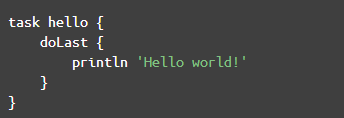

### groovy & gradle
---

#### groovy篇

1.Groovy Closures: thisObject, owner, delegate
* thisObject:闭包定义所属的类实例
* owner:和this相同，但当该closure外部还有closure时为其外面一层的closure
* delegate：和owner相同，但是可修改。

2.容器类
* List=[...]其中元素可为任意类型，通过索引访问无需考虑下标越界
* def aMap = ['key1':'value1','key2':true]，key必须是string，value任意类型。key 可以用''或""包起来，也可以不用引号包起来。

3.closure
* 类似于函数指针
```groovy
def xxx = {paramters -> code} //或者
def xxx = {无参数，纯 code} //这种 case 不需要->符号
```
闭包对象.call(参数) 或者 闭包对象(参数) 调用
* 如果闭包没定义参数的话 ，则隐含有一个参数 it ，和this的作用类似 。it代表闭包的参数。
* Groovy 中，当函数的最后一个参数是闭包的话，可以省略圆括号


4.编译成Java类
* 通过`groovyc`命令将groovy文件编译成class文件，jd-gui打开可以看到继承自script类，同时生成了static main方法，groovy中所有代码都在run方法里执行。

* 如果脚本中定义了函数，则函数会被定义在 test 类中。

5.groovy I/O
* 对Java扩充，[官方文档](http://docs.groovy-lang.org/latest/html/groovy-jdk/java/io/)

6.元编程 (MetaProgramming)

Groovy支持两类元编程：运行时和编译时。前者在代码运行阶段可以修改类的成员变量、方法，后者则只是在编译时进行（类似Java的注解生成代码）。这里只介绍运行时元编程。
```groovy
class Cls1 {
    def name = 'hello name'
// 处理未定义的属性调用
    Object propertyMissing(String name) {
        return "missing property '$name'"
    }
    // 处理未定义的方法调用
    void methodMissing(String name, Object args) {
        println "call missing method '$name()'"
    }
}
def var1 = new Cls1()
println var1.name
println var1.myName
var1.missingFunc()
```
执行结果：
```groovy
hello name
missing property 'myName'
call missing method 'missingFunc()'
```
MetaClass的支持是GroovyObject接口定义的，前面已经提到所有Groovy类都会实现这个接口。

MetaClass的作用类似闭包的delegate，当调用对象的属性/方法时，如果原始Class中没定义，会尝试在MetaClass上调用。
```groovy
class Cls2 {
}
def var2 = new Cls2()
// 新增一个func方法
var2.metaClass.func = {
    println 'hello'
}
// 拦截所有方法调用,先输出一个log,再调用原始方法
var2.metaClass.invokeMethod = { String name, Object[] args ->
    println "invoke method '$name()'"
    def originMethod = var2.metaClass.getMetaMethod(name, args)
    if (originMethod != null) originMethod.invoke(var2, args)
}
var2.func()
```
执行结果：
```groovy
invoke method 'func()'
hello
```

#### gradle篇

1.task创建方式
```gradle
task myTask { configure closure }
task myType << { task action } <==注意，<<符号 是 doLast 的缩写
task myTask(type: SomeType)
task myTask(type: SomeType) { configure closure }
```

to be continued...

参考：

* [https://dzone.com/articles/groovy-closures-owner-delegate](https://dzone.com/articles/groovy-closures-owner-delegate)
* 深入理解Android之Gradle