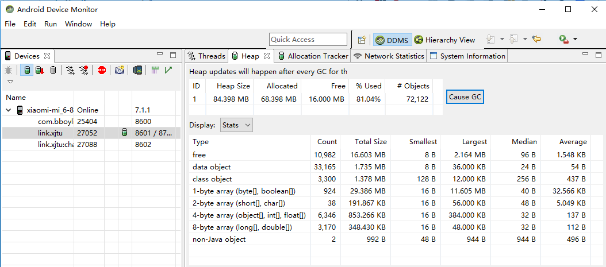
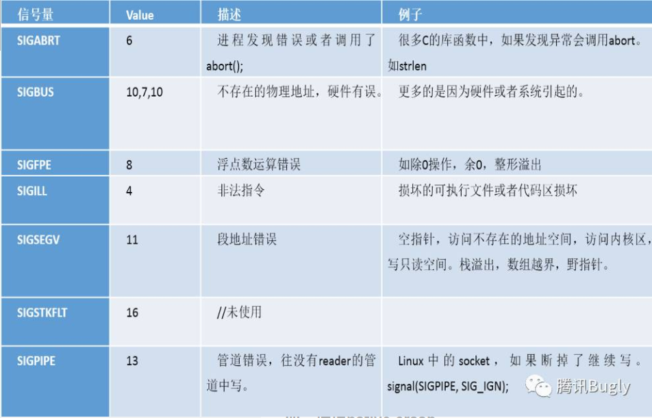
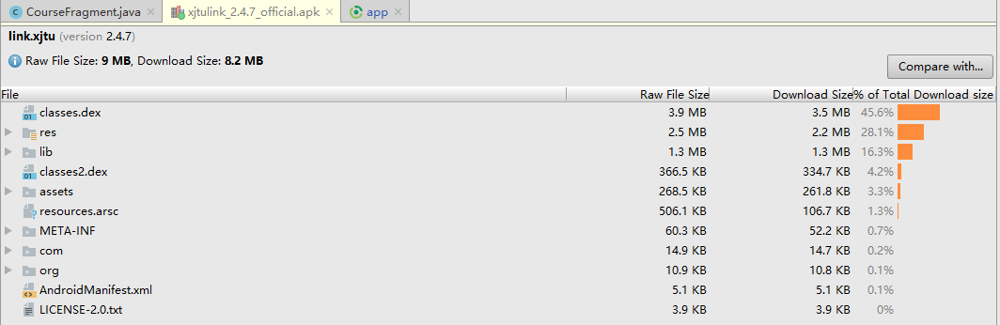

### 1. 绘制优化
---

几个概念：
* 双缓冲机制：UI总是在back buffer中绘制，然后再与front buffer交换
* VSYNC:通知CPU刷新视图的定时信号
* 三缓冲机制：比双缓冲减少了卡顿，增加了延迟（绘制的一帧要过32ms在显示）
* 绘制方法分：软件绘制（CPU）和硬件加速(GPU)，CPU负责包括Measure，Layout，Record，Execute的计算操作，GPU负责Rasterization(栅格化)操作。

检测工具：
* profile GPU rendering寻找有问题的页面：蓝色代表绘制时间。
* traceview查看方法耗时:主要关注`calls+recur calls/total`（调用次数）和`cpu time/call`（方法耗时）
* hierarchy viewer检测布局深度

布局优化方法：
* 减少布局层级：
    * 合理使用relativelayout和linearlayout
    * 用merge代替根布局（某些情况下可用，例如top bar）
* 提高显示速度：使用viewstub，只有设置为visiable以及调用inflate()的时候布局才会被加载和实例化。注意viewstub只能加载一次，也就是说viewstub对象会被置为空，之后不能再通过viewstub控制其布局。
* 布局复用（include属性等）

过度绘制：
* 检测工具：手机->开发者选项->show gpu overdraw
    * 蓝色：多绘制了1次，大片蓝色是可以接受的
    * 绿色：多绘制两次
    * 淡红：多绘制3次，不超过屏幕的1/4是可接受的
    * 深红：多绘制了4次及以上。严重影响性能，需要优化。
* 如何避免：
    * 布局：降低层级，减少不必要背景。
    * 自定义view：`canvas.quickReject()`快速判断是否需要绘制，`canvas.clipRect()`避免绘制越界。

启动优化：
* 冷启动：创建一个新的进程，创建并初始化application实例，创建和初始化mainActivity实例。热启动：直接创建和初始化mainActivity实例
* 启动耗时检测：
    * `adb shell am start -W [packageNName]/[packageName.AppstartActivity]` 执行后得到thisTime,TotalTime（创建进程+application初始化+activity初始化到界面显示）,WaitTime。
    * 代码打点：TimeMonitor

### 2. 内存优化
---

GC类型：
* kGcCauseForAlloc：分配内存时发现内存不够引起的GC，会stop the world
* kGcCauseBackground：内存达到一定阈值时触发的GC，后台GC，不会stop the world
* kGcCauseExplicit：显式调用时进行的GC，如果ART打开了这个选项，在system.gc()时会进行GC

GC日志：
```
11-17 10:19:45.257: D/dalvikvm(22511): GC_EXPLICIT freed 14K, 52% free 3715K/7687K, external 7372K/9177K, paused 25ms
```
其格式为：`[GC原因] [释放了多少VM内存], [VM堆内存统计], [外部内存统计], [VM暂停时间]`表示本次为显式GC，回收了14KB内存，回收后52%的内存可用，存活的对象大小为3715KB,堆大小是7687KB，external同理是指native memory，存放位图数据或者堆以外内存之类的。GC暂停了25ms

其中GC原因分这么几类：
* `GC_CONCURRENT` : 堆内存上涨时避免因堆内存满了而触发GC
* `GC_FOR_MALLOC` : 由于concurrent gc没有执行完，又需要分配更多的内存，这时不得不停下来进行malloc gc
* `GC_EXTERNAL_ALLOC` : 为external分配的内存执行的GC
* `GC_HPROF_DUMP_HEAP` : 创建一个HPROF profile时执行
* `GC_EXPLICIT` : 显式调用了system.gc()

内存分析工具：
* memory monitor ：Android studio 3.0开始被替代为android profiler。从view->tool windows->android profiler，可以查看CPU，memory，network等信息。
* heap viewer : 在tools->android->android device monitor

* allocation tracker : 入口和heap viewer位置邻近，方便追踪内存分配情况，并记录调用栈。

内存泄漏：
* MAT检测 ：
    * 先下载MAT客户端
    * 在Android device monitor（DDMS）处dump HPROF file
    * hprof-conv转格式：dalvik->J2SE
    * MAT打开转换后的HPROF文件

### 3. 存储优化：
---

sp优化：
* I/O性能。因为sp实际上是一个xml文件存储K-V键值对，所以读取数据到内存和写入数据到磁盘都比较耗时。写的时候尽量异步写（apply，不需要返回值），commit是同步写，返回值。
* 同步锁问题：commitToMerory()方法会锁定sp对象，put()和getEditor()方法会锁定editor对象，写入磁盘时还有一个写入锁。所以要避免频繁的读写SP

### 4. 稳定性优化
---

提升代码质量
* code review
* 代码静态扫描工具
    * checkStyle
    * Android lint
    * 阿里巴巴Java代码风格规约插件

Crash监控
* Java层：实现`UncaughtExceptionHandler`接口，并用自定义的`crashHanlder`设置成进程默认的`UncaughtExceptionHandler`
```java
import java.io.BufferedWriter;
import java.io.File;
import java.io.FileWriter;
import java.io.IOException;
import java.io.PrintWriter;
import java.lang.Thread.UncaughtExceptionHandler;
import java.text.SimpleDateFormat;
import java.util.Date;

import android.content.Context;
import android.content.pm.PackageInfo;
import android.content.pm.PackageManager;
import android.content.pm.PackageManager.NameNotFoundException;
import android.os.Build;
import android.os.Environment;
import android.os.Process;
import android.util.Log;

public class CrashHandler implements UncaughtExceptionHandler {
    private static final String TAG = "CrashHandler";
    private static final boolean DEBUG = true;

    private static final String PATH = Environment.getExternalStorageDirectory().getPath() + "/CrashTest/log/";
    private static final String FILE_NAME = "crash";
    private static final String FILE_NAME_SUFFIX = ".trace";

    private static CrashHandler sInstance = new CrashHandler();
    private UncaughtExceptionHandler mDefaultCrashHandler;
    private Context mContext;

    private CrashHandler() {
    }

    public static CrashHandler getInstance() {
        return sInstance;
    }

    public void init(Context context) {
        mDefaultCrashHandler = Thread.getDefaultUncaughtExceptionHandler();
        Thread.setDefaultUncaughtExceptionHandler(this);
        mContext = context.getApplicationContext();
    }

    /**
     * 这个是最关键的函数，当程序中有未被捕获的异常，系统将会自动调用#uncaughtException方法
     * thread为出现未捕获异常的线程，ex为未捕获的异常，有了这个ex，我们就可以得到异常信息。
     */
    @Override
    public void uncaughtException(Thread thread, Throwable ex) {
        try {
            //导出异常信息到SD卡中
            dumpExceptionToSDCard(ex);
            uploadExceptionToServer();
            //这里可以通过网络上传异常信息到服务器，便于开发人员分析日志从而解决bug
        } catch (IOException e) {
            e.printStackTrace();
        }

        ex.printStackTrace();

        //如果系统提供了默认的异常处理器，则交给系统去结束我们的程序，否则就由我们自己结束自己
        if (mDefaultCrashHandler != null) {
            mDefaultCrashHandler.uncaughtException(thread, ex);
        } else {
            Process.killProcess(Process.myPid());
        }

    }

    private void dumpExceptionToSDCard(Throwable ex) throws IOException {
        //如果SD卡不存在或无法使用，则无法把异常信息写入SD卡
        if (!Environment.getExternalStorageState().equals(Environment.MEDIA_MOUNTED)) {
            if (DEBUG) {
                Log.w(TAG, "sdcard unmounted,skip dump exception");
                return;
            }
        }

        File dir = new File(PATH);
        if (!dir.exists()) {
            dir.mkdirs();
        }
        long current = System.currentTimeMillis();
        String time = new SimpleDateFormat("yyyy-MM-dd HH:mm:ss").format(new Date(current));
        File file = new File(PATH + FILE_NAME + time + FILE_NAME_SUFFIX);

        try {
            PrintWriter pw = new PrintWriter(new BufferedWriter(new FileWriter(file)));
            pw.println(time);
            dumpPhoneInfo(pw);
            pw.println();
            ex.printStackTrace(pw);
            pw.close();
        } catch (Exception e) {
            Log.e(TAG, "dump crash info failed");
        }
    }

    private void dumpPhoneInfo(PrintWriter pw) throws NameNotFoundException {
        PackageManager pm = mContext.getPackageManager();
        PackageInfo pi = pm.getPackageInfo(mContext.getPackageName(), PackageManager.GET_ACTIVITIES);
        pw.print("App Version: ");
        pw.print(pi.versionName);
        pw.print('_');
        pw.println(pi.versionCode);

        //android版本号
        pw.print("OS Version: ");
        pw.print(Build.VERSION.RELEASE);
        pw.print("_");
        pw.println(Build.VERSION.SDK_INT);

        //手机制造商
        pw.print("Vendor: ");
        pw.println(Build.MANUFACTURER);

        //手机型号
        pw.print("Model: ");
        pw.println(Build.MODEL);

        //cpu架构
        pw.print("CPU ABI: ");
        pw.println(Build.CPU_ABI);
    }

    private void uploadExceptionToServer() {
      //TODO Upload Exception Message To Your Web Server
    }

}
```

* native层：主要在捕获Linux的crash信号。这里我基本没接触过，略。


ANR分析：
* 分三类：KeyDispatchTimeout/BroadcastTimeout/ServiceTimeout
* 获取traces.txt（不必root）：`adb pull /data/anr/traces.txt`

提升后台进程存活率：
* 降低应用内存开销是减少进程被系统回收概率的一个有效办法。
* 进程优先级从低到高：(可在`${android-sdk-path}\sources\android-23\com\android\server\am\ProcessList.java`中查看)
```java
    // Adjustment used in certain places where we don't know it yet.
    // (Generally this is something that is going to be cached, but we
    // don't know the exact value in the cached range to assign yet.)
    static final int UNKNOWN_ADJ = 1001;

    // This is a process only hosting activities that are not visible,
    // so it can be killed without any disruption.
    static final int CACHED_APP_MAX_ADJ = 906;
    static final int CACHED_APP_MIN_ADJ = 900;

    // The B list of SERVICE_ADJ -- these are the old and decrepit
    // services that aren't as shiny and interesting as the ones in the A list.
    static final int SERVICE_B_ADJ = 800;

    // This is the process of the previous application that the user was in.
    // This process is kept above other things, because it is very common to
    // switch back to the previous app.  This is important both for recent
    // task switch (toggling between the two top recent apps) as well as normal
    // UI flow such as clicking on a URI in the e-mail app to view in the browser,
    // and then pressing back to return to e-mail.
    static final int PREVIOUS_APP_ADJ = 700;

    // This is a process holding the home application -- we want to try
    // avoiding killing it, even if it would normally be in the background,
    // because the user interacts with it so much.
    static final int HOME_APP_ADJ = 600;

    // This is a process holding an application service -- killing it will not
    // have much of an impact as far as the user is concerned.
    static final int SERVICE_ADJ = 500;

    // This is a process with a heavy-weight application.  It is in the
    // background, but we want to try to avoid killing it.  Value set in
    // system/rootdir/init.rc on startup.
    static final int HEAVY_WEIGHT_APP_ADJ = 400;

    // This is a process currently hosting a backup operation.  Killing it
    // is not entirely fatal but is generally a bad idea.
    static final int BACKUP_APP_ADJ = 300;

    // This is a process only hosting components that are perceptible to the
    // user, and we really want to avoid killing them, but they are not
    // immediately visible. An example is background music playback.
    static final int PERCEPTIBLE_APP_ADJ = 200;

    // This is a process only hosting activities that are visible to the
    // user, so we'd prefer they don't disappear.
    static final int VISIBLE_APP_ADJ = 100;
    static final int VISIBLE_APP_LAYER_MAX = PERCEPTIBLE_APP_ADJ - VISIBLE_APP_ADJ - 1;

    // This is the process running the current foreground app.  We'd really
    // rather not kill it!
    static final int FOREGROUND_APP_ADJ = 0;

    // This is a process that the system or a persistent process has bound to,
    // and indicated it is important.
    static final int PERSISTENT_SERVICE_ADJ = -700;

    // This is a system persistent process, such as telephony.  Definitely
    // don't want to kill it, but doing so is not completely fatal.
    static final int PERSISTENT_PROC_ADJ = -800;

    // The system process runs at the default adjustment.
    static final int SYSTEM_ADJ = -900;

    // Special code for native processes that are not being managed by the system (so
    // don't have an oom adj assigned by the system).
    static final int NATIVE_ADJ = -1000;
```
粗略的分的话主要是五类：
* 前台进程
* 可见进程
* 服务进程
* 后台进程
* 空进程

更多优先级相关的请移步这篇博客：[Android系统中的进程管理：进程的优先级](http://qiangbo.space/2016-11-23/AndroidAnatomy_Process_OomAdj/)

提升进程优先级方法：
* 网络连接：通过长连接心跳和进程保持通信，使进程保持活动状态。但如果内存不足也可能被杀。
* 利用系统现有机制：注册系统消息（AlarmReceiver、BootReceiver等），通过系统消息响应挂起进程。
* SyncAdapter：具体请看[一种提高Android应用进程存活率新方法](http://skyseraph.com/2016/06/19/Android/一种提高Android应用进程存活率新方法/)

### 5. 安装包大小优化
---

安装包瘦身常用方法：
* 混淆：使用Proguard，主要功能是压缩，优化，混淆。参考：[https://developer.android.com/studio/build/shrink-code.html?hl=zh-cn](https://developer.android.com/studio/build/shrink-code.html?hl=zh-cn)，[http://www.jianshu.com/p/60e82aafcfd0](http://www.jianshu.com/p/60e82aafcfd0)
* 资源优化:
    * Android lint删除多余资源：analyze->run inspection by name->unused resources
    * 资源文件最少化：套图、三方库、预置图片（改服务器下发）
    * 图片压缩：png图片压缩工具等(如[imageoptim](https://imageoptim.com/mac))
* 其他优化：
    * 避免重复第三方库
    * [使用webP图片格式](https://developer.android.com/studio/write/convert-webp.html)：Android studio中图片右键：convert to webp
    * 插件化

工具：[apk-analyzer](https://developer.android.com/studio/build/apk-analyzer.html) : build->analyze apk...（注意选择不含instant run zip文件的apk）



实践：[Playing APK Golf
Reducing an Android APK's size by 99.99%](https://fractalwrench.co.uk/posts/playing-apk-golf-how-low-can-an-android-app-go/)

---
References：【Android性能优化最佳实践】