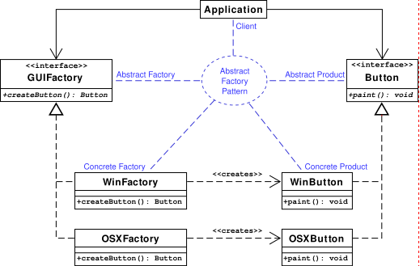

# 抽象工厂模式
---

* 定义：为创建一组相关或相互依赖的对象提供一个接口，而且无需指定他们的具体类。
* UML类图：



* 代码示例：
```java

public abstract class AbstractCreator {

	//创建A产品家族
	public abstract AbstractProductA createProductA();

	//创建B产品家族
	public abstract AbstractProductB createProductB();
}

public class Creator1 extends AbstractCreator {

  //只生产产品等级为1的A产品
  public AbstractProductA createProductA() {
    return new ProductA1();
  }

  //只生产铲平等级为1的B产品
  public AbstractProductB createProductB() {
    return new ProductB1();
  }

}

public class Creator2 extends AbstractCreator {

  //只生产产品等级为2的A产品
  public AbstractProductA createProductA() {
    return new ProductA2();
  }

  //只生产铲平等级为2的B产品
  public AbstractProductB createProductB() {
    return new ProductB2();
  }

}

public class Client {

	public static void main(String[] args) {
		//定义出两个工厂
		AbstractCreator creator1 = new Creator1();
		AbstractCreator creator2 = new Creator2();
		
		//产生A1对象
		AbstractProductA a1 =  creator1.createProductA();
		//产生A2对象
		AbstractProductA a2 = creator2.createProductA();
		//产生B1对象
		AbstractProductB b1 = creator1.createProductB();
		//产生B2对象
		AbstractProductB b2 = creator2.createProductB();
		
		/*
		 * 然后在这里就可以为所欲为了...
		 */
		
	}
}

```

---

更多：[抽象工厂模式和工厂模式的区别？ - 回答作者: caoglish](https://www.zhihu.com/question/20367734/answer/82361745)
