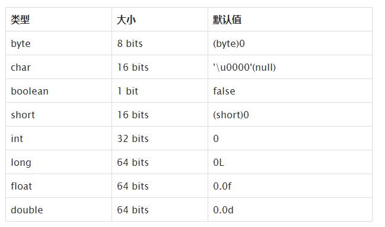
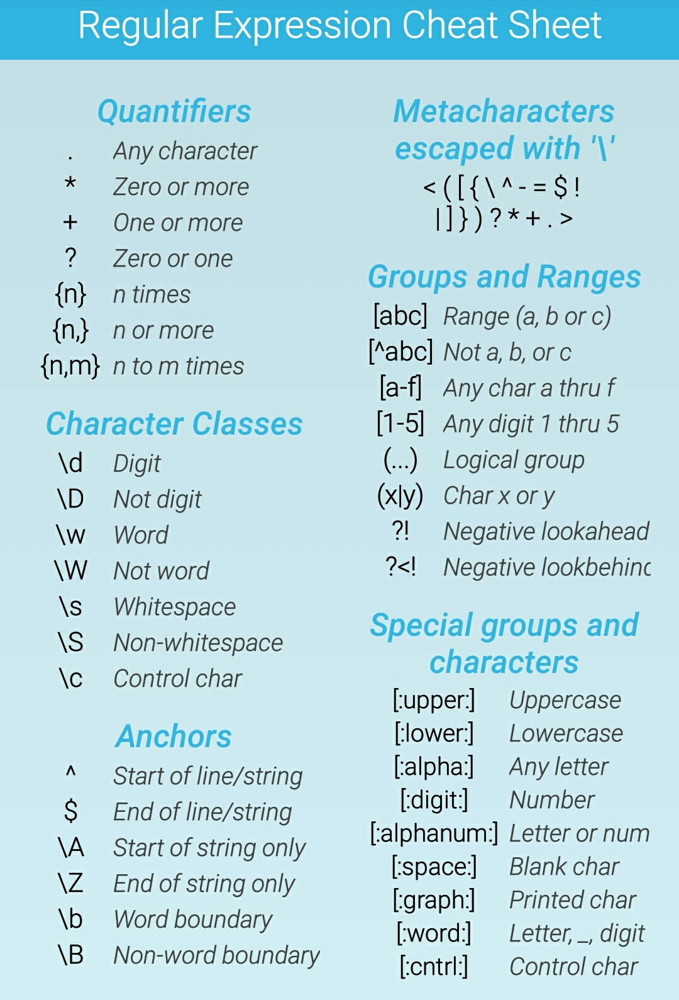

### notes of thinking in java（上）：chapter 1-13
---
* chapter1 : Introduction to Objects
    * 主数据类型(Primitive Type)</br>
   

* chapter2 : Everything is an Object
    * 用引用操作对象
    * 内存</br>
   


* chapter3 : Operators
    * ==和！=比较的是对象的引用，equals()比较的是对象的内容</br>
指数计数：1.39e-43f/47e47d</br>
移位：<<左移右补0，>>有符号右移左边补符号数，>>>无符号右移左边补0，零扩展
</br>java允许把任何数据类型转换为另一种基本类型，但是布尔量除外。</br>
java没有sizeof因为不同机器上相同的数据类型具有相同大小。（JVM）</br>

* chapter4 : Controlling Execution
    * 略

* chapter5 : Initialization & Clean up
    * 方法重载：参数类型列表（按返回值重载不可行）
    * 实例化对象并调用方法时初始化顺序：</br>
（1）普通类：静态成员、普通成员、构造器（重载）、方法
      （多次实例时static只执行一次）</br>
（2）继承: 基类静态,基类普通成员,基类构造器（重载时按顺序初始化）（编译器自动调用基类构造）,子类静态,子类普通成员,子类构造器（重载）,子类或基类方法
    * 内存清理：垃圾回收器只回收无法到达的无用对象（new分配的内存），但不知道回收非new方式的特殊内存。所以通过调用finalize()手动回收，但finalize不能保证立即回收，需等到下一次垃圾回收动作时才执行回收（finalize的不及时性最好不直接调用，它无法替代析构函数），因此必须手动清理。
显式地清理用dispose()方法
    * 回收器如何工作：对象存储空间的分配，堆指针移动到未分配区域即可，工作时一面回收空间，一面使堆中的对象紧凑排列，高速、有无限空间可分配。每个对象都有一个引用计数器，有引用时+1，离开引用时-1，垃圾回收器遍历所有对象列表，引用计数为0 时释放空间，循环引用的处理比较麻烦。
    另一种：根据目前的存活对象深度查找关联引用对象，不活动的则会释放。停止—复制方式，先把存活对象从当前堆复制到另一个堆，没有被复制的都是垃圾，复制后的对象也是紧密排列的，比较好。此种模式效率较低。此外，一但程序进入稳定状态后，极少会产生垃圾，此时复制就是浪费。
    一些虚拟机会转换到标记—横扫模式，速度慢，但是当你知道有很少垃圾时，它就很快了。遍历存活对象，给对象标记不会被回收，全部标记完成才会清理。更详细的请参考：[java中的垃圾回收机制](https://github.com/bboylin/bboylin.github.io/tree/master/part3/gc/readme.md)

* chapter6 : Access Control
    * priavte          本类可见</br>
public            所有类可见</br>
protected      本包和所有子类都可见</br>
friendly          本包可见（即默认的形式）</br>

* chapter7 : Reusing Classes
    * 组合，继承，代理（在两个类之间增加对象或行为适配，由适配器来完成）。
    * final数据一般用于永不改变的编译时常量，或运行时被初始化的值，而你不希望他被改变。多用于基本类型，而不是对象引用。一个既是static又是final的域只占据一段不能变的存储空间，命名应用大写表示，各单词下划线分割。
</br>final参数表示可以读不能写，即不能改变引用的对象
</br>final方法防止继承时改变功能

* chapter8 : Polymorphism
    * 多态就是指程序中定义的引用变量所指向的具体类型和通过该引用变量发出的方法调用在编程时并不确定，而是在程序运行期间才确定，即一个引用变量到底会指向哪个类的实例对象，该引用变量发出的方法调用到底是哪个类中实现的方法，必须在由程序运行期间才能决定。因为在程序运行时才确定具体的类，这样，不用修改源程序代码，就可以让引用变量绑定到各种不同的类实现上，从而导致该引用调用的具体方法随之改变，即不修改程序代码就可以改变程序运行时所绑定的具体代码，让程序可以选择多个运行状态，这就是多态性。
    * 面向对象三大基本特征：封装，继承，多态。继承是多态得以实现的基础，比如sellCar(Car car)里面的参数可以是Car的任何子类。
    * 除static、final外，其他的方法都是后期编译器自动绑定的。静态方法不具备多态性

* chapter9 ： Interfaces
    *  接口中的方法、域、内嵌接口等默认都是public的</br>
放入接口中的域都会自动变成static、final的</br>
可向上转型为多个接口类型</br>
java单继承多实现（接口），而c++多重继承。</br>
类中嵌套接口和非嵌套接口一样，可以拥有public和包访问两种可视性。
    * 联系：[工厂方法模式](https://github.com/bboylin/bboylin.github.io/tree/master/android&designPattern/FactoryMethodPattern.md)

* chapter10 : Inner Classes
    * 当一个新类继承一个外部类时，外部类内嵌的内部类不会被自动继承。因此，无法再新类中简单地覆盖内部类。可以用“外部类.内部类”的方式来继承内部类，并可用这种方法来覆盖父类内部类的方法

* chapter11 ：Holding Your Objects
    * 容器分类图</br>
    </br>
    * 泛型和类型安全的容器
        * ArrayList，可以自动扩充大小的数组，add插入对象，get访问对象，size查看对象数目。
        * 泛型（就是跟在ArrayList后面的那个尖括号指明Apple类型的标识）的添加可以在编译期间防止将错误类型的对象放进容器中。
同样，容器也可以用foreach语法。
    * 概念
        * Collection，List顺序保存元素，Set不能有重复元素，Queue按照排队来。
        * Map,键值对，通过键找值，也成为字典
        * 注意collection是接口`public interface List<E>
extends Collection<E>;
public class ArrayList<E>
extends AbstractList<E>
implements List<E>, RandomAccess, Cloneable, Serializable`
    * 添加一组元素</br>Collections.addAll()方法参数默认为collection，Arrays.asList()参数为数组，返回List.</br>
```java
public class AddGroup {
    public static void main(String[] args) {
        Collection<Integer> c = new ArrayList<Integer>(Arrays.asList(1,2,3,4));
        Integer[] group = {5,6,7,8 };
        c.addAll(Arrays.asList(group));
        System.out.println(c);
        Collections.addAll(c, 9,0);
        System.out.println(c);
    }
}
//[1, 2, 3, 4, 5, 6, 7, 8]
//[1, 2, 3, 4, 5, 6, 7, 8, 9, 0]
```

    * 容器的打印
        * 具体的容器已经实现了自己的toString方法,collection打印的用[]括住，元素用,分隔；map打印用{}括住，键值由等号连接，每组键值用,分割

    * List
        * ArrayList，随机访问元素快，中间插入和删除操作慢。
        * LinkedList，随机访问慢，但是中间插入和删除快，类似链表。
        * 常用方法
```java
class Member{
    int age;
    Member(int i){
        age = i;
    }
    public String toString(){
        return "member"+age;
    }
}

public class ListMethod {
    public static void main(String[] args) {
        List<Member> members = new ArrayList<Member>();
        Member member1 = new Member(1);
        
        //添加元素
        members.add(member1);
        
        //判断容器是否为空
        System.out.println(members.isEmpty());
        
        //判断容器是否包含该元素
        System.out.println(members.contains(member1));
        
        //显示索引
        System.out.println(members.indexOf(member1));
        
        //移除元素
        members.remove(member1);
        System.out.println(members);
        
        Member member2 = new Member(2);
        Member member3 = new Member(3);
        Member member4 = new Member(4);
        members.add(member2);
        members.add(member3);
        members.add(member4);
        
        //类似subString，从索引0开始截取到1，包含0和1
        System.out.println(members.subList(0, 2));
        
        //移除 不同于remove
        //removeAll(Collection<?> c) 
        //remove(int index)   remove(Object o) 
        members.removeAll(members);
        System.out.println(members);
    }    
}
```

* Iterator
```java
Iterator<Member> iterator = members.iterator();
        while(iterator.hasNext()){
            System.out.println(iterator.next());
        }
```
只能单向移动，next移动下一个元素，但是拿到的当前元素。hasNext检查是否还有元素,iterator()返回一个iterator，remove（）将迭代器新近返回的元素删除

* ListIterator</br>
     可双向移动，增加了hasPrevious()和previous()方法

* LinkedList，随机访问慢，但是中间插入和删除快，类似链表。</br>
```java
public class TestLinkedList {
    public static void main(String[] args) {
        LinkedList<Member> members = new LinkedList<Member>();
        Member member1 = new Member(1);
        Member member2 = new Member(2);
        Member member3 = new Member(3);
        members.add(member1);
        members.add(member2);
        members.add(member3);
        //返回列表头
        System.out.println(members.peek());
        //移除并返回列表头
        System.out.println(members.removeFirst());
        System.out.println(members);
        //返回并移除表头
        System.out.println(members.poll());
        System.out.println(members);
        //removelast 移除最后一个
        members.add(member1);
        members.add(member2);
        System.out.println(members.removeLast());
        System.out.println(members);
        //addLast和add一样 都是往列表尾插入元素 addFirst自然就是表头
        members.add(member2);
        members.addFirst(member2);
        members.addLast(member2);
        System.out.println(members);
    }
}
```

* stack(LIFO)</br>LinkedList具有能够直接实现栈的所有功能的方法，因此可以直接将LinkedList作为栈使用。</br>
```java
public interface Stack<T> {
    public T push(T item);
    public T pop();
    public T peek();
    public boolean empty();
    public int search(T desiredItem);
    public Iterator<T> iteraotr();
    public ListIterator<T> listIterator();
}
```
* set
    * 和collection一样的接口，但是行为不同（继承和多态思想的应用）
    * hashset和treeset，linkedhashset维护的顺序都不同，因为treeset将元素存储在红黑中，hashset采用散列函数，linkedhashset也采用散列，但看起来使用了链表维护元素的插入顺序。
    * 无序不重复，treeset有序
    * 源代码</br>
```java
package com.kiritor;
/**
  Set源码研究*/
import java.util.Iterator;
public interface Set<E> extends Collection<E> {
    int size();
    boolean isEmpty();
    boolean contains(Object o);
    Iterator<E> iterator();
    Object[] toArray();
    <T> T[] toArray(T[] a);
    boolean add(E e);
    boolean remove(Object o);
    boolean containsAll(Collection<?> c);
    boolean addAll(Collection<? extends E> c);
    boolean retainAll(Collection<?> c);
    boolean removeAll(Collection<?> c);
    void clear();
    boolean equals(Object o);
    int hashCode();
}
```
* map
    * 将对象映射到其他对象的能力是解决编程问题的杀手锏。(例如查看随机数的分布)
    * 很容易扩展到多维
    * containsKey(),containsValue()

* queue（FIFO）
    * linkedlist实现了queue的接口，可看做queue的一种实现，可向上转型为queue。
    * 方法:避免使用add、remove，这两者失败时会抛出异常，而要采用offer、poll等队列特性方法。
        * add：加入
        * remove、poll：移除并返回队头
        * peek、element：不移除并返回队头
        * offer：插入队尾

* PriorityQueue
    * An unbounded priority queue based on a priority heap. 
        The elements of the priority queue are ordered according to their natural ordering, or by a Comparator provided at queue construction time, depending on which constructor is used. 
        A priority queue does not permit null elements.
        A priority queue relying on natural ordering also does not permit insertion of non-comparable objects (doing so may result in ClassCastException).
    * 声明下一个弹出元素是最需要的元素

* Collection&Iterator
    * 略

* Foreach&Iterator
    * 略

* chapter 12 ：Error Handling with Exceptions
    * finally：当你要把除内存之外的资源恢复到它们的初始状态时，就要用到finally子句。这种需要清理的资源包括：已经打开的文件或网络连接，你在屏幕上画的图形，甚至可以是外部世界的某个开关。
当涉及到break和continue语句的时候，finally子句也会得到执行。请注意，如果把finally子句和带标记的break及continue配合使用，在Java里就没必要使用goto语句了。
    * 更多细节参考：[http://jiangjun.name/thinking-in-java/28](http://jiangjun.name/thinking-in-java/28)

* chapter 13 : Strings
    * string类作为参数时采用值传递，即不改变原有string对象。区分：值传递，指针传递，引用传递。（C++常遇到的问题）
    * java并不允许重载运算符，用于string的+和+=是仅有的两个重载过的运算符,实质是利用StringBuilder的append()方法。（和c++大不同，c++重载运算符比较常见）在循环中直接利用string+=或者string+会创建多个StringBuilder对象，正确做法应该是循环外自己创建一个StringBuilder，然后循环内调用append()方法。诸如append(a+":"+c)这样想省事的语句也会创建多个StringBuilder，应该避免。
    * system.out.printf()和system.out.format()是等价的，用法和c语言一样
    * 新的格式化功能使用java.util.Formatter类处理。string.format()返回string对象
    * 正则表达式语法：</br>
    *  java的正则表达式中反斜杠与其他语言有不同含义，其他语言中\\表示要插入一个字面上的反斜杠，没有特殊含义；而java中的反斜杠则表示我要插入一个正则表达式的反斜杠，其后的字符具有特殊意义，比如表示一位数字，\\d</br>
	* string.split()方法将string从匹配的地方切开。
    * 关于pattern和matcher类：参考[http://www.cnblogs.com/ggjucheng/p/3423731.html](http://www.cnblogs.com/ggjucheng/p/3423731.html)


---
to be continued

