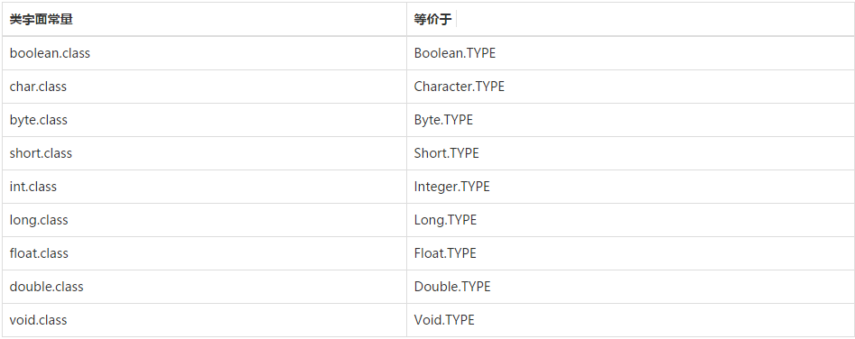

### thinking in java(下)
---

* chapter 14 : Type Information
    * 为什么需要RTTI：运行时发现和使用类的信息
    * class对象：
        * 每个类都有一个class对象。每当编写并编译了一个新类，就会产生一个Class对象（更恰当地说，是被保存在一个同名的.class文件中）。为了生成这个类的对象，运行这个程序的Java虚拟机将使用被称为“类加载器”的子系统。
        * 所有的类都是在对其第一次使用时，动态加载到JVM中的。当程序创建第一个对类的静态成员的引用时，就会加载这个类。这个证明构造器也是类的静态方法，因此使用new操作符创建类的新对象也会被当作对类的静态成员的引用。
        * Java程序在它开始运行之前并非被完全加载，其各个部分是在必需时才加载的。
        * 获取对class对象的引用，使用`Class.forName(全限定类名，包含包名)`或者`类名.class`（类字面常量）。前者会初始化该class对象，后者不会。使用后者更安全也更简单，因为他在编译时就会受到检查，因此不需要置于try语句块中，并且根除了对forName()方法的调用，因此也更高效。类字面常量不仅可应用于普通的类，也可以应用于接口，数组，以及基本数据类型。对于基本数据类型的包装器类，还有标准字段TYPE。

            

        * class类的常用方法
            >Class#getName()：返回此类的全限定名（包名+类名）
</br>Class#getSimpleName()：返回此类的类名
</br>Class#getCanonicalName()：返回此类的全限定名（包名+类名）
</br>Class#isInterface()：判定此类是不是接口
</br>Class#getInterfaces()：返回此类实现的接口的Class类对象。
</br>Class#getSuperClass()：返回此类的基类的Class类对象。 ！注意：当得到的Class是Object，会返回null。
</br>Class#newInstance()：返回此类的一个对象。（注：此类必须有默认构造器）
</br>Class#getModifiers()：获得一个类的修饰词，比如final, static, abstract等。和Modifier配合使用，像这样：Modifier.isAbstract(Class#getModifiers())可以判断一个类是不是抽象类。

        * 为了使用类所做的准备工作包含：
            * 加载，类加载器执行。查找字节码，并从字节码中创建一个class对象。
            * 链接，验证类中的字节码，为静态域分配存储空间，并且如果必须的话，将解析这个类创建的对其它类的所有引用。
            * 初始化，如果该类具有超类，则对其初始化，执行静态初始化器和静态初始化。
            
            初始化被延迟到了对静态方法（构造器）或者非常数静态域进行首次引用时才执行。
        * 泛型语法：通过使用泛型语法，可以让编译器强制执行额外的类型检查。`Class<Integer> genericIntClass = int.class;`
        * 新的转型语法：
            ```java
            Building b = new House();
            Class<House> houseType = House.class;
            House h = houseType.cast(b); 
            h = (House)b;
            ```
    * 类型转换前先做检查
        * `if(x instanceof Dog) ((Dog)x).bark()`,instanceof运算符的动态等价:`Pet.class.isInstance(dog)`
    * instanceof与Class的等价性:instanceof保持了类型的概念，它表示“该类是否为某个类或是其派生类”，而equals()和==比较实际的Class对象，则不考虑继承，或者是这个确切的类型，或者不是。
    * RTTI和反射之间真正的区别在于，对RTTI来说，编译器在编译时打开和检查.class文件。而对于反射机制来说，.class文件在编译时是不可获取的，所以是在运行时打开和检查.class文件。

* chapter 15 ：Generics
    * 面向对象的泛化机制（多态）：将方法的参数设为基类，该方法可以接收这个基类中导出的所有类作为参数。考虑到除了final类和私有构造器的类不能扩展，其他所有类都可以被扩展，所以这种灵活性大多数时候也会带来一定的性能损耗。而泛型实现了参数化类型的概念。
    * 简单泛型
        * 可重用性：持有对象<持有object对象<泛型
        * 元组（tuple）：元组就是将一组对象直接打包存储进一个单一对象，这个容器只允许读取，不允许放入新的对象（这个概念也称为数据传送对象或信使）。可以解决想在一个return语句中返回多个对象的问题。泛型可以让我们很容易的创建元组。下面是利用泛型实现元组的一个实例：
        ```java
        public class TwoTuple<A,B> {
            public final A first ;
            public final B second ;
            public TwoTuple(A first,B second){
                this.first = first ;
                this.second = second ;
            }
            public String toString() { return first +"," +second ;}
        }
        ```
            java编程中的安全性原则：变量声明为private，使用get和set方法访问。final自带安全保险，一般声明为public，而且简洁明了。
        * 一个堆栈类：链式栈的实现
        ```java
        public class LinkedStack<T> {

            private static class Node<U> {
                U item;
                Node<U> next;

                Node(){
                    item=null;
                    next=null;
                }

                Node(U item, Node<U> next) {
                    this.item = item;
                    this.next = next;
                }

                boolean end() {
                    return item == null && next == null;
                }
            }

            private Node<T> top=new Node<T>();

            public void push(T item){
                top=new Node<T>(item,top);
            }

            public T pop(){
                T result=top.item;
                if (!top.end()){
                    top=top.next;
                }
                return result;
            }

            public static void main(String[] args) {
                LinkedStack<String> lss=new LinkedStack<>();
                for (String s:"hello world I see you".split(" ")){
                    lss.push(s);
                }
                String s;
                while ((s=lss.pop())!=null){
                    System.out.println(s);
                }
            }
        }
        ```
        泛型的局限：无法传入基本类型。
    * 类型擦除：泛型类型只有在静态类型检查期才出现。java的泛型是伪泛型，因为在编译的时候所有的泛型信息都会被擦除掉。正确理解泛型概念的首要前提是理解类型擦出（type erasure）。
        * Java中的泛型基本上都是在编译器这个层次来实现的。在生成的Java字节码中是不包含泛型中的类型信息的。使用泛型的时候加上的类型参数，会在编译器在编译的时候去掉。这个过程就称为类型擦除。
        * 如在代码中定义的List<object>和List<String>等类型，在编译后都会编程List。JVM看到的只是List，而由泛型附加的类型信息对JVM来说是不可见的。Java编译器会在编译时尽可能的发现可能出错的地方，但是仍然无法避免在运行时刻出现类型转换异常的情况。类型擦除也是Java的泛型实现方法与C++模版机制实现方式之间的重要区别。
        两个例子
        ```java
        public class Test4 {
            public static void main(String[] args) {
                ArrayList<String> arrayList1=new ArrayList<String>();
                arrayList1.add("abc");
                ArrayList<Integer> arrayList2=new ArrayList<Integer>();
                arrayList2.add(123);
                System.out.println(arrayList1.getClass()==arrayList2.getClass());
            }
        }
        //结果为true
        ```
        ```java
        public class Test4 {
            public static void main(String[] args) throws IllegalArgumentException, SecurityException, IllegalAccessException, InvocationTargetException, NoSuchMethodException {
                ArrayList<Integer> arrayList3=new ArrayList<Integer>();
                arrayList3.add(1);//这样调用add方法只能存储整形，因为泛型类型的实例为Integer
                arrayList3.getClass().getMethod("add", Object.class).invoke(arrayList3, "asd");
                for (int i=0;i<arrayList3.size();i++) {
                    System.out.println(arrayList3.get(i));
                }
            }
        ```

        在程序中定义了一个ArrayList泛型类型实例化为Integer的对象，如果直接调用add方法，那么只能存储整形的数据。不过当我们利用反射调用add方法的时候，却可以存储字符串。这说明了Integer泛型实例在编译之后被擦除了，只保留了原始类型。 

        * 类型擦除后保留的原始类型：原始类型（raw type）就是擦除去了泛型信息，最后在字节码中的类型变量的真正类型。无论何时定义一个泛型类型，相应的原始类型都会被自动地提供。类型变量被擦除（crased），并使用其限定类型（无限定的变量用Object）替换。 
    例如泛型参数T会被替换成Object，<T extends F>会被F替换。如果类型变量有限定，那么原始类型就用第一个边界的类型变量来替换。如`<T extends Comparable& Serializable>`会被替换成`Comparable`，注意：如果Pair这样声明public class Pair<T extends Serializable&Comparable> ，那么原始类型就用Serializable替换，而编译器在必要的时要向Comparable插入强制类型转换。为了提高效率，应该将标签（tagging）接口（即没有方法的接口）放在边界限定列表的末尾。
        * 泛型不能用于显式地引用运行时类型的操作之中，例如转型、instanceof操作和new表达式。
        * 要区分原始类型和泛型变量的类型
            </br>在调用泛型方法的时候，可以指定泛型，也可以不指定泛型。
            </br>在不指定泛型的情况下，泛型变量的类型为 该方法中的几种类型的同一个父类的最小级，直到Object。
            </br>在指定泛型的时候，该方法中的几种类型必须是该泛型实例类型或者其子类。
            
            ```java
            public class Test2{
                public static void main(String[] args) {
                    /**不指定泛型的时候*/
                    int i=Test2.add(1, 2); //这两个参数都是Integer，所以T为Integer类型
                    Number f=Test2.add(1, 1.2);//这两个参数一个是Integer，以风格是Float，所以取同一父类的最小级，为Number
                    Object o=Test2.add(1, "asd");//这两个参数一个是Integer，以风格是Float，所以取同一父类的最小级，为Object

                            /**指定泛型的时候*/
                    int a=Test2.<Integer>add(1, 2);//指定了Integer，所以只能为Integer类型或者其子类
                    int b=Test2.<Integer>add(1, 2.2);//编译错误，指定了Integer，不能为Float
                    Number c=Test2.<Number>add(1, 2.2); //指定为Number，所以可以为Integer和Float
                }
                
                //这是一个简单的泛型方法
                public static <T> T add(T x,T y){
                    return y;
                }
            }
            ```

其实在泛型类中，不指定泛型的时候，也差不多，只不过这个时候的泛型类型为Object，就比如ArrayList中，如果不指定泛型，那么这个ArrayList中可以放任意类型的对象。
            
```java
    public static void main(String[] args) {
        ArrayList arrayList=new ArrayList();
        arrayList.add(1);
        arrayList.add("121");
        arrayList.add(new Date());
    }
```

* 类型擦除引起的问题及解决方法
    * 先类型检查再编译：既然说类型变量会在编译的时候擦除掉，那为什么我们往ArrayList<String> arrayList=new ArrayList<String>();所创建的数组列表arrayList中，不能使用add方法添加整形呢？不是说泛型变量Integer会在编译时候擦除变为原始类型Object吗，为什么不能存别的类型呢？既然类型擦除了，如何保证我们只能使用泛型变量限定的类型呢？
java是如何解决这个问题的呢？java编译器是通过先检查代码中泛型的类型，然后再进行类型擦除，在进行编译的。

那么，这么类型检查是针对谁的呢？我们先看看参数化类型与原始类型的兼容
以ArrayList举例子，以前的写法：
```java
ArrayList arrayList=new ArrayList();
```
现在的写法：
```java
ArrayList<String>  arrayList=new ArrayList<String>();
```
如果与以前的写法兼容会出现下列情况：
```java
ArrayList<String> arrayList1=new ArrayList(); //第一种 情况
ArrayList arrayList2=new ArrayList<String>();//第二种 情况
```
这样是没有错误的，不过会有个编译时警告。
不过在第一种情况，可以实现与 完全使用泛型参数一样的效果，第二种则完全没效果。
因为，本来类型检查就是编译时完成的。new ArrayList()只是在内存中开辟一个存储空间，可以存储任何的类型对象。而真正涉及类型检查的是它的引用，因为我们是使用它引用arrayList1 来调用它的方法，比如说调用add()方法。所以arrayList1引用能完成泛型类型的检查。
而引用arrayList2没有使用泛型，所以不行。
举例子：

通过上面的例子，我们可以明白，类型检查就是针对引用的，谁是一个引用，用这个引用调用泛型方法，就会对这个引用调用的方法进行类型检测，而无关它真正引用的对象。

* 自动类型转换
```java
public class Test {
public static void main(String[] args) {
ArrayList<Date> list=new ArrayList<Date>();
list.add(new Date());
Date myDate=list.get(0);//get方法返回Object。在调用的地方进行Object到Date类型的强转，而不是get方法处。
}
```
