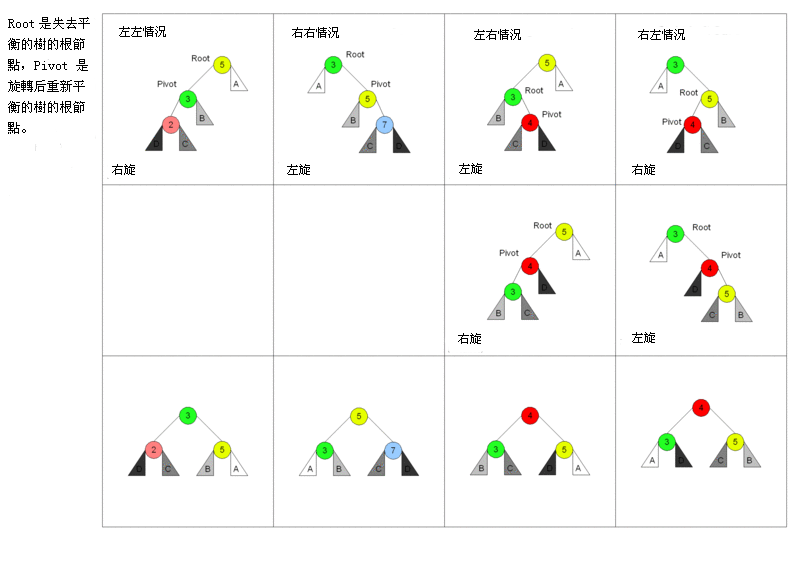
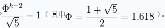

## 平衡二叉树之AVL
---
AVL是每个节点满足左子树和右子树高度差小于等于1的平衡二叉树。查找、插入和删除在平均和最坏情况下都是O（log n）。增加和删除可能需要通过一次或多次树旋转来重新平衡这个树。

节点的平衡因子是它的左子树的高度减去它的右子树的高度（有時相反）。带有平衡因子1、0或 -1的节点被认为是平衡的。带有平衡因子 -2或2的节点被认为是不平衡的，并需要重新平衡这个树。平衡因子可以直接存储在每个节点中，或从可能存储在节点中的子树高度计算出来。

AVL涉及到的一般操作有：
* 旋转

*  插入

    向AVL树插入，可以透过如同它是未平衡的二叉查找树一样，把给定的值插入树中，接着自底往上向根节点折回，于在插入期间成为不平衡的所有节点上进行旋转来完成。因为折回到根节点的路途上最多有1.44乘log n个节点，而每次AVL旋转都耗费固定的时间，所以插入处理在整体上的耗费為O(log n) 时间。
* 删除

    从AVL树中删除，可以透过把要删除的节点向下旋转成一个葉子節點，接着直接移除这个叶子节点来完成。因为在旋转成葉子節點期间最多有log n个节点被旋转，而每次AVL旋转耗费固定的时间，所以删除处理在整体上耗费O(log n) 时间。
* 搜尋

    可以像普通二叉查找树一样的进行，所以耗费O(log n)时间，因为AVL树总是保持平衡的。不需要特殊的准备，树的结构不会由于查找而改变。（这是与[伸展樹](https://github.com/bboylin/MyNoteBook/tree/master/part4/splay.md)搜尋相对立的，它会因为搜尋而变更树结构。）
* 节点数
    
    高度為h的AVL樹，節點數N最多2^h -1； 最少

    最少節點數n如以費伯納西數列可以用數學歸納法證明：
    
    N_h = F_{h+2} - 1 (F_{h+2}是Fibonacci polynomial)。
    
    即:
    
    N_0 = 0 (表示AVL Tree高度為0的節點總數)
    
    N_1 = 1 (表示AVL Tree高度為1的節點總數)
    
    N_2 = 2 (表示AVL Tree高度為2的節點總數)
    
    N_h = N_{h-1} + N_{h-2} + 1 (表示AVL Tree高度為h的節點總數)
    
    換句話說，當節點數為N時，高度h最多為

[AVL的c++/java实现](https://github.com/bboylin/AVL)