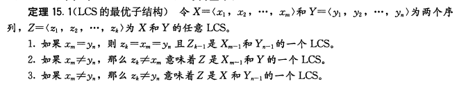

## dynamic programming
---
Hallmarks:

* 1.can recursively be divided into a subproblem
* 2.overlaping subproblems: a recursive solution contains a small number of distinct subproblems repeated many times
* 3.using tables to store the data is much faster

Steps:
* 1.刻画一个最优解的结构特征
* 2.递归的定义最优解的值
* 3.计算最优解的值，通常采用自底向上的方法
* 4.利用计算出的信息构造一个最优解

Solution:
* 1.自顶向下递归实现（不属于动态规划，复杂度为指数级，不推荐）
* 2.带备忘的自顶向下法（top-down with memoization）:用表保存一个子问题的解，需要时先检查是否保存过此解，从而减少递归调用。
* 3.自底向上法，与二等价，但是通常开销的常数系数更小：从小到大求解，同时用表保存所有的解


* 1.钢条切割：

记长度为i的钢条收益为Pi，

则长度为N的钢条最大收益Rn=max(pi+Rn-i) 1<=i<=n

自顶向下的实现：
```c++
int cut-rod(int[] p,int n){
    if(n==0){
        return 0;
    }
    int q=0;
    for(int i=1;i<n+1;++i){
        q=max(q,p[i]+cut-rod(p,n-i))
    }
}
```

自底向上的实现：

```c++
int bottom-up-cut-rod(int[] p,int n){
    int r[n+1];//r[i]长度为i的钢条的最大收益
    r[0]=0;
    for(int j=1;j<n+1;j++){
        q=0;
        for(int i=1;i<j+1;++i){
            q=max(q,p[i]+r[j-i]);
        }
        r[j]=q;
    }
    return r[n];
}
```

* 2.Longest Common Sequence:



根据上述思路我们可以得到

```java
if(i==0||j==0) z[i,j]=0;
if(i>0&&j>0&&x[i]=y[j]) z[i,j]=z[i-1,j-1]+1;
if(i>0&&j>0&&x[i]!=y[j]) z[i,j]=max(z[i-1,j],z[i,j-1]);
```

* 3.最长回文子序列：

最优解的结构特征：
```c++
	int lps(char *seq, int i, int j)
	{
	   // Base Case 1: If there is only 1 character
	   if (i == j)
	     return 1;
	 
	   // Base Case 2: If there are only 2 characters and both are same
	   if (seq[i] == seq[j] && i + 1 == j)
	     return 2;
	 
	   // If the first and last characters match
	   if (seq[i] == seq[j])
	      return lps (seq, i+1, j-1) + 2;
	 
	   // If the first and last characters do not match
	   return max( lps(seq, i, j-1), lps(seq, i+1, j) );
	}
```

动态规划解法：

```java
	// Returns the length of the longest palindromic subsequence in seq
	int lps(char *str)
	{
	   int n = strlen(str);
	   int i, j, cl;
	   int L[n][n];  // Create a table to store results of subproblems
	 
	 
	   // Strings of length 1 are palindrome of lentgh 1
	   for (i = 0; i < n; i++)
	      L[i][i] = 1;
	 
	    // Build the table. Note that the lower diagonal values of table are
	    // useless and not filled in the process. The values are filled in a
	    // manner similar to Matrix Chain Multiplication DP solution (See
	    // http://www.geeksforgeeks.org/archives/15553). cl is length of
	    // substring
	    for (cl=2; cl<=n; cl++)
	    {
	        for (i=0; i<n-cl+1; i++)
	        {
	            j = i+cl-1;
	            if (str[i] == str[j] && cl == 2)
	               L[i][j] = 2;
	            else if (str[i] == str[j])
	               L[i][j] = L[i+1][j-1] + 2;
	            else
	               L[i][j] = max(L[i][j-1], L[i+1][j]);
	        }
	    }
	 
	    return L[0][n-1];
	}
```

