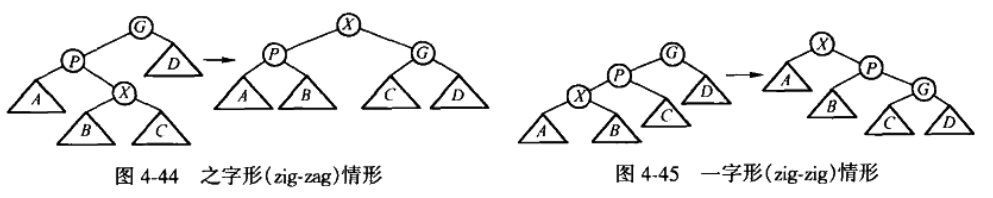

## 伸展树
---

* 定义

伸展树（Splay Tree）是一种自平衡二叉搜索树，它保证从空树开始连续M次对树的操作最多花费O（M logN）时间，但这并不排除任意单次操作花费O（N）时间的可能。对于伸展树而言不存在坏的输入序列，每次操作的摊还代价是O（logN）。伸展树的基本想法是，一个节点被访问后就要经过一系列AVL树的旋转被推到根上。另外，伸展树还不需要保留高度和平衡信息，某种程序上节省了空间并简化了代码。

* 伸展：
    * x的父节点是根，则旋转x与父节点的边。
    
    * zig-zag:x与父节点和祖父节点成<或者>形状，类似于AVL的双旋转。
    * zig-zig:x与父节点和祖父节点成一字形
    
* 查找：和普通二叉搜索树查找一样，但是查找后要伸展
* 插入：也是先插入再伸展
* 删除：
    * 无子节点：直接删除，再将父节点伸展到根节点处
    * 有一个子节点：子节点替代其位置，将父节点伸展到根节点处
    * 两个子节点：找后继节点，后继节点代替之，然后将后继节点伸展到根节点处。

* 实现：

```c++
#include "splay.h"
#include <iostream>
#include <cstdlib>

/* RR(Y rotates to the right):

        k2                   k1
       /  \                 /  \
      k1   Z     ==>       X   k2
     / \                      /  \
    X   Y                    Y    Z
*/
inline splay* RR_Rotate(splay* k2)
{
	splay* k1 = k2->lchild;
	k2->lchild = k1->rchild;
	k1->rchild = k2;
	return k1;
}

/* LL(Y rotates to the left):

        k2                       k1
       /  \                     /  \
      X    k1         ==>      k2   Z
          /  \                /  \
         Y    Z              X    Y
 */
inline splay* LL_Rotate(splay* k2)
{
	splay* k1 = k2->rchild;
	k2->rchild = k1->lchild;
	k1->lchild = k2;
	return k1;
}

/* An implementation of top-down splay tree 
 If key is in the tree, then the node containing the key will be rotated to root,
 else the last non-NULL node (on the search path) will be rotated to root.
 */
splay* Splay(int key, splay* root)
{
	if(!root)
		return NULL;
	splay header;
	/* header.rchild points to L tree; header.lchild points to R Tree */
	header.lchild = header.rchild = NULL;
	splay* LeftTreeMax = &header;
	splay* RightTreeMin = &header;
	
	/* loop until root->lchild == NULL || root->rchild == NULL; then break!
	   (or when find the key, break too.)
	 The zig/zag mode would only happen when cannot find key and will reach
	 null on one side after RR or LL Rotation.
	 */
	while(1)
	{
		if(key < root->key)
		{
			if(!root->lchild)
				break;
			if(key < root->lchild->key)
			{
				root = RR_Rotate(root); /* only zig-zig mode need to rotate once,
										   because zig-zag mode is handled as zig
										   mode, which doesn't require rotate, 
										   just linking it to R Tree */
				if(!root->lchild)
					break;
			}
			/* Link to R Tree */
			RightTreeMin->lchild = root;
			RightTreeMin = RightTreeMin->lchild;
			root = root->lchild;
			RightTreeMin->lchild = NULL;
		}
		else if(key > root->key)
		{
			if(!root->rchild)
				break;
			if(key > root->rchild->key)
			{
				root = LL_Rotate(root);/* only zag-zag mode need to rotate once,
										  because zag-zig mode is handled as zag
										  mode, which doesn't require rotate, 
										  just linking it to L Tree */
				if(!root->rchild)
					break;
			}
			/* Link to L Tree */
			LeftTreeMax->rchild = root;
			LeftTreeMax = LeftTreeMax->rchild;
			root = root->rchild;
			LeftTreeMax->rchild = NULL;
		}
		else
			break;
	}
	/* assemble L Tree, Middle Tree and R tree together */
	LeftTreeMax->rchild = root->lchild;
	RightTreeMin->lchild = root->rchild;
	root->lchild = header.rchild;
	root->rchild = header.lchild;
	
	return root;
}

splay* New_Node(KEY_TYPE key)
{
	splay* p_node = new splay;
	if(!p_node)
	{
		fprintf(stderr, "Out of memory!\n");
		exit(1);
	}
	p_node->key = key;
	p_node->lchild = p_node->rchild = NULL;
	return p_node;
}

/* Implementation 1: 
   First Splay(key, root)(and assume the tree we get is called *), so root node and 
   its left child tree will contain nodes with keys <= key, so we could rebuild 
   the tree, using the newly alloced node as a root, the children of original tree
   *(including root node of *) as this new node's children.

NOTE: This implementation is much better! Reasons are as follows in implementation 2.
NOTE: This implementation of splay tree doesn't allow nodes of duplicate keys!
 */
splay* Insert(KEY_TYPE key, splay* root)
{
	static splay* p_node = NULL;
	if(!p_node)
		p_node = New_Node(key);
	else // could take advantage of the node remains because of there was duplicate key before.
		p_node->key = key;
	if(!root)
	{
		root = p_node;
		p_node = NULL;
		return root;
	}
	root = Splay(key, root);
	/* This is BST that, all keys <= root->key is in root->lchild, all keys > 
	   root->key is in root->rchild. (This BST doesn't allow duplicate keys.) */
	if(key < root->key)
	{
		p_node->lchild = root->lchild;
		p_node->rchild = root;
		root->lchild = NULL;
		root = p_node;
	}
	else if(key > root->key)
	{
		p_node->rchild = root->rchild;
		p_node->lchild = root;
		root->rchild = NULL;
		root = p_node;
	}
	else
		return root;
	p_node = NULL;
	return root;
}

/*
 Implementation 2: 
 First do the insertion as a BST insertion, then splay(key, root).
Note: Implementation 1 & Implementation 2 will lead to different splay trees.

This implementation is NOT recommend! because it needs first to go down to insert
a node, which requires O(h). Since splay tree is not balanced, so there does exist
bad insertion sequence which will lead insertion to O(n) each time(so O(n) in 
amortized time).
But in implementation 1, the time complexity is up to Splay() during one insertion. 
So the amortized time of insertion is O(logn).
 */
/*
splay* Insert(KEY_TYPE key, splay* root)
{
	splay* p_node = New_Node(key);
	if(!root)
		return p_node;
	splay* parent_temp;
	splay* temp = root;
	while(temp)
	{
		parent_temp = temp;
		if(key <= temp->key)
			temp = temp->lchild;
		else
			temp = temp->rchild;
	}
	if(key <= parent_temp->key)
		parent_temp->lchild = p_node;
	else
		parent_temp->rchild = p_node;
	
	return (root=Splay(key, root));
}
*/


/*
Implementation: just Splay(key, root), if key doesn't exist in the tree(key != 
root->key), return root directly; else join the root->lchild and root->rchild 
and then free(old_root). 
To join T1 and T2 (where all elements in T1 < any element in T2) is easy if we 
have the largest element in T1 as T1's root, and here's a trick to simplify code,
see "Note" below.
 */
splay* Delete(KEY_TYPE key, splay* root)
{
	splay* temp;
	if(!root)
		return NULL;
	root = Splay(key, root);
	if(key != root->key) // No such node in splay tree
		return root;
	else
	{
		if(!root->lchild)
		{
			temp = root;
			root = root->rchild;
		}
		else
		{
			temp = root;
			/*Note: Since key == root->key, so after Splay(key, root->lchild), 
			  the tree we get will have no right child tree. (key > any key in 
			  root->lchild)*/
			root = Splay(key, root->lchild);
			root->rchild = temp->rchild;
		}
		free(temp);
		return root;
	}
}

splay* Search(KEY_TYPE key, splay* root)
{
	return Splay(key, root);
}

void InOrder(splay* root)
{
	if(root)
	{
		InOrder(root->lchild);
		std::cout<< "key: " <<root->key;
		if(root->lchild)
			std::cout<< " | left child: "<< root->lchild->key;
		if(root->rchild)
			std::cout << " | right child: " << root->rchild->key;
		std::cout<< "\n";
		InOrder(root->rchild);
	}
}
```


