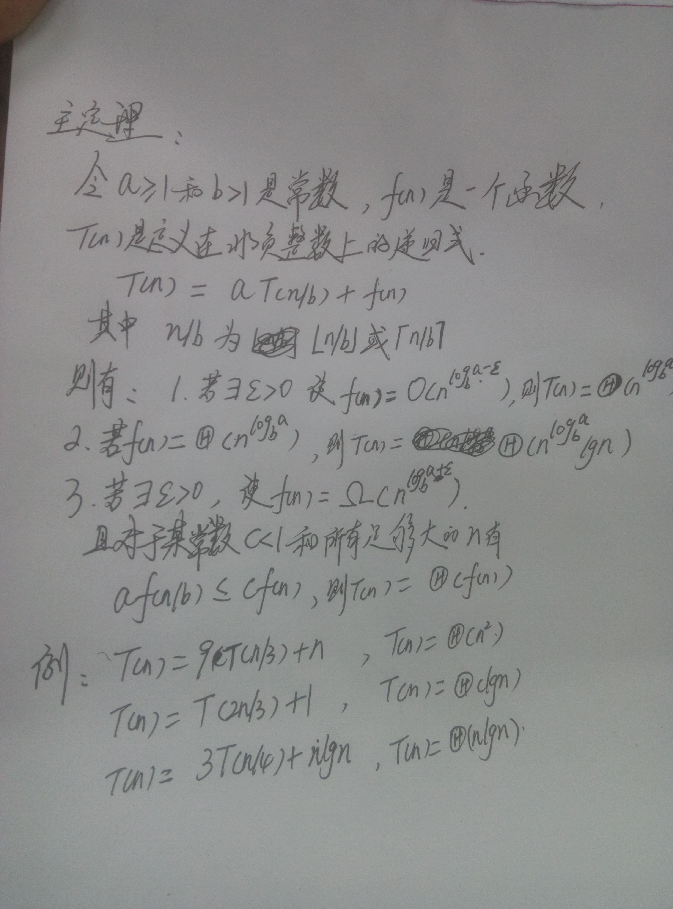

## 算法基础杂记
---

* 几个数学定义：
    * 存在正常数c和n0使得当N>=n0时，T(N)<=cf(N),则记为T(N)=O(f(N))
    * 存在正常数c和n0使得当N>=n0时，T(N)>=cg(N),则记为T(N)=Ω(g(N))
    * T(N)=Θ(f(n))当且仅当T(N)=O(f(n))和T(N)=Ω(f(n))

* 如果一个算法用常数时间将问题大小缩减为一部分（常为1/2），那么该算法就是O（logN）。另一方面，如果用常数时间只是问题大小减少一个常数的数量，那么该算法为O（N）

* 主定理：



* 尾递归：尾递归和一般的递归不同在对内存的占用，普通递归创建stack累积而后计算收缩，尾递归只会占用恒量的内存（和迭代一样）。用一段python代码来解释
```python
def recsum(x):
  if x == 1:
    return x
  else:
    return x + recsum(x - 1)
```
当调用recsum(5)，Python调试器中发生如下状况：
```python
recsum(5)
5 + recsum(4)
5 + (4 + recsum(3))
5 + (4 + (3 + recsum(2)))
5 + (4 + (3 + (2 + recsum(1))))
5 + (4 + (3 + (2 + 1)))
5 + (4 + (3 + 3))
5 + (4 + 6)
5 + 10
15
```
这个曲线就代表内存占用大小的峰值，从左到右，达到顶峰，再从右到左收缩。而我们通常不希望这样的事情发生，所以使用迭代，只占据常量stack space(更新这个栈！而非扩展他)。
（一个替代方案：迭代）
```python
for i in range(6):
  sum += i
```
因为Python，Java，Pascal等等无法在语言中实现尾递归优化(Tail Call Optimization, TCO)，所以采用了for, while, goto等特殊结构代替recursive的表述。Scheme则不需要这样曲折地表达，一旦写成尾递归形式，就可以进行尾递归优化。

Python中可以写（尾递归）：
```python
def tailrecsum(x, running_total=0):
  if x == 0:
    return running_total
  else:
    return tailrecsum(x - 1, running_total + x)
```
理论上类似上面：
```
tailrecsum(5, 0)
tailrecsum(4, 5)
tailrecsum(3, 9)
tailrecsum(2, 12)
tailrecsum(1, 14)
tailrecsum(0, 15)
15
```
观察到，tailrecsum(x, y)中形式变量y的实际变量值是不断更新的，对比普通递归就很清楚，后者每个recsum()调用中y值不变，仅在层级上加深。所以，尾递归是把变化的参数传递给递归函数的变量了。

怎么写尾递归？形式上只要最后一个return语句是单纯函数就可以。如：
```
return tailrec(x+1);
```
而
```
return tailrec(x+1) + x;
```
则不可以。因为无法更新tailrec()函数内的实际变量，只是新建一个栈。

但Python不能尾递归优化（Java不行，C可以，我不知道为什么），这里是用它做个例子。


如何优化尾递归：
在编译器处理过程中生成中间代码（通常是三地址代码），用编译器优化。

* 循环数组实现的队列为空的条件：back=front-1
* 树：路径长度就是边数。node深度为根到node的长度。node的高是node到叶子的最长路径。
* 表达式树：叶子是操作数，节点为operator，先序和后序分别对应前缀和后缀表达式。利用栈构建表达式树。
* 二叉树简单的插入：插入书作为叶子结点。删除分三种情形，叶子--直接删，有一个子节点--以子节点替换之，两个子节点--寻找大于他的最小节点替换之。如果删除的次数不多，通常用的策略是懒惰删除：当一个元素要被删除时仍留在树中，只是被标记为删除，这特别是在有重复项的时候比较常用，因为此时记录频率数的项可以减1.
* 平衡二叉树：[红黑树](http://blog.csdn.net/qq_29407877/article/details/49556143)，[AVL](https://github.com/bboylin/MyNoteBook/tree/master/part4/avl.md).etc
---
to be continued