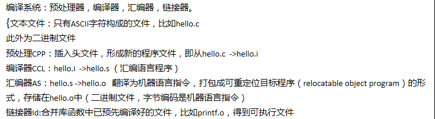
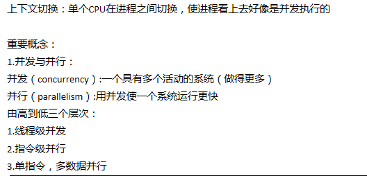
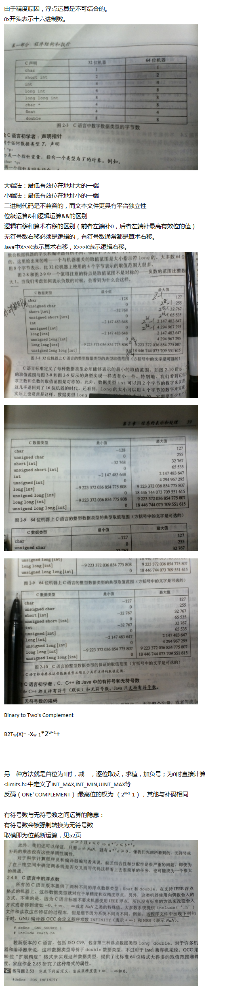
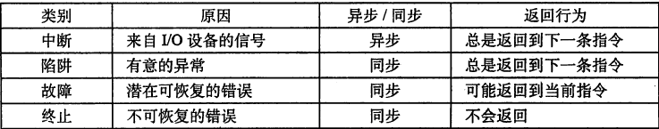
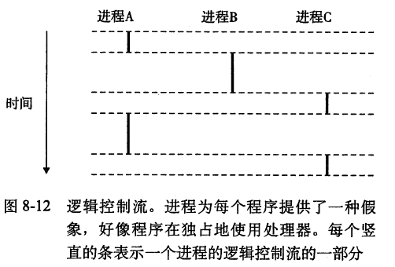

## <center>深入理解计算机系统部分笔记
---
写的比较杂，也没什么逻辑性.
* chapter1：计算机系统漫游



* chapter2：信息的表示和处理


* chapter5：优化程序性能
    * 妨碍优化的因素
        * 存储器别名使用
        * 函数副作用
    * 举例
```c++
//存储器别名使用
void twiddle1(int *xp ,int *yp){
    *xp+=*yp;
    *xp+=*yp;    
}
void twiddle2(int *xp,int *yp){
    *xp+=2* *yp;
}
//乍一看，两个函数功能一样，而且函数2比函数1有优化
//（twiddle2()只要求三次存储器引用：读*xp,读*yp,写*xp。
//而twiddle1()则执行了6次存储器引用）
```
但是考虑xp=yp时，函数1让*xp变成4倍,函数2则为3倍。
再举个例子
```c++
*q=x;
*p=y;
t=*q;//t=x or y，考虑p=q时
```
再来看看函数调用这个妨碍优化的因素
```c++
void func1(){
    return f()+f()+f()+f();
}
void func2(){
    return 4*f();
}
```
正常情况下以func2()作为func1()的优化是没问题的。但是考虑下面这个函数。
```
int counter=0;

int f(){
    return counter++;
}
```
该函数有副作用--会改变全局程序状态的一部分，改变调用它的次数会改变程序的行为。
解决方法是用内联函数替换优化函数调用。

* chapter6：存储器层次结构
    * 正金字塔结构：从上到下依次：寄存器，L1高速缓存(SRAM)，L2高速缓存(SRAM)，L3高速缓存(SRAM)，主存(DRAM)，本地二级存储（本地磁盘），远程二级存储（分布式文件系统，web服务器）。
    * 数据里通过主线在处理器和主存之间来回。总线事务分为读事物和写事务，读事务从主存传送数据到处理器，写事务从处理器传递数据到主存。总线是一组并行的导线能传递地址，数据，控制信号。
    * 磁盘构造：由大到小是：磁盘，盘片，表面，磁道，扇区，字节。
    * 对扇区的访问时间有三个主要部分:寻道时间，旋转时间，传送时间，

* chapter 8：异常
    * 异常可以分为四类：中断，陷阱，故障，终止。


    * 进程：系统中的程序都是运行在某个进程的上下文中的。进程提供给应用程序的关键抽象有：一个独立的逻辑控制流，一个私有的地址空间。


        一个逻辑流的执行在时间上和另一个流重叠，称为并发流。如上图中A,B并发的运行，A,C也一样，B,C则不是并发的。因为B的最后一条指令在C第一条指令之前执行。

        多个流并发执行的一般现象叫并发，一个进程和其他进程轮流运行的概念叫做多任务。并发与CPU核数或者计算机数无关，并行流是指两个流并发的运行在不同的处理器或者计算机上。并行流是并发流的真子集。

    * 内核为每个进程维持一个上下文，上下文就是内核重新启动一个被抢占的进程所需的状态。
    * 上下文切换
        * 1.保存当前进程的上下文。
        * 2.恢复某个先前被抢占的进程被保存的上下文
        * 3.将控制传递给这个新恢复 的进程。
    * 进程总是处于下面三种状态之一：
        * 运行：要么在cpu上执行，要么等待被执行切最终会被cpu调度。
        * 停止：进程的执行被挂起，且不能被调度。
        * 终止;进程永远停止了，导致的原因有三种：1.收到终止信号。2.从主程序返回。3.调用exit函数。
    * fork函数：新创建的子进程几乎但不完全与父进程相同。子进程得到父进程用户级虚拟地址空间相同但是独立的一份拷贝，包括文本，数据和bss段，堆和用户栈。子进程还得到和父进程任何打开文件描述符相同的拷贝。这意味着父进程调用fork时，子进程可以读取父进程打开的任何文件。父进程和子进程最大的不同是有不同的PID。fork函数调用一次返回两次，一次在父进程中，一次在子进程中。父进程中fork返回子进程的PID，子进程中fork返回0。子进程和父进程是并发运行的独立进程。
    * 回收子进程：进程终止时，内核不是立即将其清除。而是，进程一直保持在已终止的状态中，直到被他的父进程回收。一个终止了但还未进行回收的进程称为僵死进程（zombie）。如果父进程还没回收他的zombie子进程就终止了，那么内核就会安排init进程来回收他们。init进程的PID为1，而且是在系统初始化时由内核创建的。
    * 让进程休眠：sleep函数让进程挂起一段时间，如果请求的时间已到，返回0.否则返回剩余要休眠的秒数。pause函数让几次呢哼休眠，直到接到一个信号。

* chapter 12：并发编程
    * 三种基本的构造并发程序的方法：进程，IO多路复用，线程。
    
        第一种方法中，我们为每个流使用了独立的进程，内核会自动调度每个进程。每个进程有自己的私有地址空间，使得流之间共享数据很困难。
        
        第二种方法中，我们创建自己的逻辑流，并利用IO多路复用来显式地调度流。因为只有一个进程，所有的流共享整个地址空间。
        
        第三种：线程，就是运行在进程上下文中的逻辑流。线程由内核自动调度。每个线程有自己的线程上下文，包括一个唯一的整数线程ID（TID），栈，栈指针，程序计数器，通用目的寄存器和条件码。所有运行在一个进程中的线程共享该进程的整个虚拟地址空间。 
        
        因为线程的上下文比进程的上下文小得多，所以线程上下文切换比进程上下文切换快得多。与一个进程相关的线程组成一个对等(线程)池，独立于其他进程创建的线程。主线程和其他线程的区别仅在于他是进程中第一个运行的线程。对等池概念的主要影响是，一个线程可以杀死他的任何对等线程或者等待他的任意对等线程终止。每个对等线程能读写相同的共享数据。
    * 信号量(semaphore)：信号量S是具有非负整数值的全局变量，只能由两种特殊的操作来处理，称为P和V。
        * P(s):如果S是非零的，P将S减1，并且立即返回。如果S为0，那么就挂起这个线程，直到S非零而一个V操作会重启这个线程，重启后P操作将S减1，并将控制返回给调用者。
        * V(s):将S加1。如果有任何线程阻塞在P操作等待S变成非零，那么V操作会重启这些线程中的一个。然后该线程将S减1，完成他的P操作。
    * 使用信号量来实现互斥：以提供互斥为目的的二元信号量通常称为互斥锁。互斥锁上执行P操作称为加锁，V操作称为解锁。对一个互斥锁加了锁但没有解锁的线程称为占用这个锁。
    * 利用信号量调度共享资源：
        * 生产者-消费者问题：生产者-->优先缓冲区-->消费者线程。
        
            举例：多媒体系统中，生产者编码视频帧，而消费者解码并在屏幕上显现出来。缓冲区目的是为了减少视频流的抖动。

            另一个常见的例子是图形用户接口设计。生产者检测到鼠标和键盘事件，并将他们插入到缓冲区内。消费者以某种优先级从缓冲区中取出这些事件，并显示在屏幕上。

        * 读者-写者问题：写者必须保持对对象独占的访问，读者可以和无限多个读者共享同一个对象。
            * 第一类：读者优先，要求不要让读者等待，除非已有一个写者占有着使用对象的权限。
            * 第二类：写者优先，一旦有一个写者准备好可以写，他会尽快完成他的写操作。
    * 其他并发问题：
        * 线程安全：四个线程不安全的函数类：
            * 不保护共享变量的函数。如对一个全局变量加1。这种函数改为安全的较为容易，利用像P,V这样的操作来保护共享变量。优点在于调用程序不需要任何修改，缺点在于同步操作增加了程序运行时间。
            * 保持跨越多个调用状态的函数。当前调用的结果依赖于前次调用的中间结果。改进方法是重写该函数：使之不再依赖任何static变量而是利用参数传递状态信息。
            * 返回指向静态变量的指针的函数：例如ctime，将计算结果放在一个static变量中，然后返回指向该变量的指针。危险在于并发调用时，static变量结果可能被另一线程覆盖。改进方法有两种，第一：重写，参考上面那条。第二：lock-and-copy。每一个调用位置对互斥锁加锁，函数返回结果存到一个私有存储器上，然后对互斥锁解锁。为了尽可能减少对调用者的修改，应该定义一个线程安全的包装函数，执行加锁-拷贝，然后用该包装函数的调用代替所有不安全的调用。
            * 调用线程不安全函数的函数：f调用线程不安全函数g，如果g是第二类的，那f一定是线程不安全的。如果g是第一或者第三类，那么只要加一个互斥锁保护调用位置和任何得到的共享数据，f依然可能是线程安全的。

        * 可重入函数：被多个线程调用时不会引入任何共享数据。是线程安全函数的真子集。可重入函数一般比不可重入的线程安全的函数高效一点，因为不需要同步操作。
        * 竞争：当一个程序的正确性依赖于一个线程要在另一个线程到达Y点时到达他的控制流的X点时，就会发生竞争。
        ```c
        /* 
        * race.c - demonstrates a race condition
        */
        /* $begin race */
        #include "csapp.h"
        #define N 4
        
        void *thread(void *vargp);
        
        int main() 
        {
        
            pthread_t tid[N];
            int i;
        
            for (i = 0; i < N; i++) 
        Pthread_create(&tid[i], NULL, thread, &i); //line:conc:race:createthread
            for (i = 0; i < N; i++) 
        Pthread_join(tid[i], NULL);
            exit(0);
        
        }
        
        /* thread routine */
        void *thread(void *vargp) 
        {
        
            int myid = *((int *)vargp);  //line:conc:race:derefarg
            printf("Hello from thread %d\n", myid);
            return NULL;
        
        }
        /* $end race */
        ```
        上例看似正确，但是myid变量取得正确的ID取决于对等线程在主线程执行12行之前执行了21行。否则它包含的就是其他线程的ID。
        
        为了消除竞争，我们可以动态的为每个整数ID分配一个独立的快。
        ```c
        /* 
        * norace.c - fixes the race in race.c
        */
        /* $begin norace */
        #include "csapp.h"
        #define N 4

        void *thread(void *vargp);

        int main() 
        {
            pthread_t tid[N];
            int i, *ptr;

            for (i = 0; i < N; i++) {
            ptr = Malloc(sizeof(int));                    //line:conc:norace:createthread1
            *ptr = i;                                     //line:conc:norace:createthread2
            Pthread_create(&tid[i], NULL, thread, ptr);   //line:conc:norace:createthread3
            } //line:conc:norace:endloop
            for (i = 0; i < N; i++) 
            Pthread_join(tid[i], NULL);
            exit(0);
        }

        /* thread routine */
        void *thread(void *vargp) 
        {
            int myid = *((int *)vargp);
            Free(vargp); 
            printf("Hello from thread %d\n", myid);
            return NULL;
        }
        /* $end norace */
        ```
        * 死锁：一组线程被阻塞了，等待一个永远不会为真的条件。应用互斥锁加锁规则来避免死锁：对于程序中每对互斥锁（s,t），每个同时占用s和t的线程都按照相同的顺序给他们加锁。每个线程就是无死锁的。进度图是理解死锁的好工具。
---
完。第一遍读的比较粗略，只是把感兴趣的章节看了一下。后续再读这本书也会更新这篇笔记。