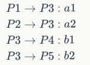

## 线程/进程/cpu调度

* 并发与并行的区别：并发是同时存在，并行是同时执行。并行有subtask的含义。(通俗一点讲，一只奶给两个孩子喂叫并发，两只奶给两个孩子喂叫并行，捂脸==)
* 线程池的优点：节省了创建线程的时间，限制可用线程数量(对不支持高并发的系统而言)
* 进程状态：new,running,ready,blocked/waiting,terminated.脑补进程状态图。
* fork：子进程返回0，父进程返回PID。与clone区别在于clone出的线程不共享数据。
* cpu调度可发生在四种情形中：
    * 1）running -> waiting(等待I/O)
    * 2) running -> ready(中断)
    * 3) waiting -> ready(I/O完成)
    * 4) terminated

    调度只能发生在1和4时称为非抢占
* 调度算法：
    * first come first served：非抢占
    * shortest job first：常用于 长期调度，可抢占可非抢占
    * priority scheduling：常导致starvation，解决办法是aging，即逐渐增加长时间等待的线程的优先级。
    * round-robin（轮转调度）：效率取决于时间片的大小。
    * multilevel queue scheduling（多级队列）：将就绪队列分多个队列，队列之间有绝对优先级，队列内有各自调度算法。
    * multilevel feedback queue scheduling(多级反馈队列)：在上面的基础上可使进程在队列间移动，可防止starvation。

## 死锁/信号量/管程

* busy waiting：当一个进程位于临界区内时，任何试图进入该临界区的进程都在进入代码中连续循环。
* 自旋锁：具有busy waiting特征的信号量叫自旋锁。在锁的占用时间短时自旋锁有优势，因为不进行上下文切换，常用于多处理器系统中。
* semaphore：包括value(若为负，绝对值为等待信号量的进程个数)和等待进程链表(signal从中选择进程唤醒)
* 死锁的定义：集合中的每一个进程都在等待只能由本集合中的其他进程才能引发的事件，那么该组进程是死锁的
* 死锁的判断：资源分配图(主要是申请边喝分配边的概念)中无环则没死锁，若每个资源类型只有一个实例，有环和死锁是互为充要条件，如果有资源类型存在不止一个实例，则有环是死锁的必要不充分条件。
* 死锁的四个必要产生条件：
    * 1）互斥条件：指进程对所分配到的资源进行排它性使用，即在一段时间内某资源只由一个进程占用。如果此时还有其它进程请求资源，则请求者只能等待，直至占有资源的进程用毕释放。
    * 2）请求和保持条件：指进程已经保持至少一个资源，但又提出了新的资源请求，而该资源已被其它进程占有，此时请求进程阻塞，但又对自己已获得的其它资源保持不放。
    * 3）不剥夺条件：指进程已获得的资源，在未使用完之前，不能被剥夺，只能在使用完时由自己释放。
    * 4）环路等待条件：指在发生死锁时，必然存在一个进程——资源的环形链，即进程集合{P0，P1，P2，···，Pn}中的P0正在等待一个P1占用的资源；P1正在等待P2占用的资源，……，Pn正在等待已被P0占用的资源。
* 预防死锁的方法：
    * 打破互斥条件：改造独占性资源为共享资源，大部分资源已无法改造。
    * 打破不可抢占条件：当一进程占有一独占性资源后又申请一独占性资源而无法满足，则退出原占有的资源。
    * 打破占有且申请条件：采用资源预先分配策略，即进程运行前申请全部资源，满足则运行，不然就等待，这样就不会占有且申请。
    * 打破循环等待条件：实现资源有序分配策略，对所有设备实现分类编号，所有进程只能采用按序号递增的形式申请资源(即，要申请序号小的资源必须先释放序号大的资源)
* 避免死锁的算法：安全性算法/资源请求算法（P222）
* 死锁定理：找出既不阻塞又不是孤点的进程Pi（进程向它连接的资源申请的数量小于或等于这个资源可用的数量）。消除其所有的边，Pi即成为了孤点。再对剩余的进程继续消除。如果能够消除所有的边，则称该图可以完全简化，没有死锁；如果有边剩余无法消除，则产生了死锁。


* 信号量
    * 信号量机制用于解决互斥与同步的问题。它只能被两个标准原语wait(S)和signal(S)来访问，也可以记为P操作和V操作。 
    
        P操作：申请资源，没有则排队等候。 
    
        V操作：释放资源，执行队列下一个。

        ```c
        typedef struct{
            int value;  struct process *L;
        }semaphore;
        void wait(semaphore S){ //P操作
            S.value--;//先减1
            if(S.value < 0){//再查看有没有
                add this process to S.L;//如果没有，加入等待区
                block(S.L);//并自我阻塞
            }
        }
        void signal(semaphore S){ //V操作
            S.value++;//资源数加1
            if(S.value <= 0){//释放之后仍有等待这个资源的进程
                remove a process P from S.L;//把这个进程从队列中移除
                wakeup(P);//然后唤醒这个进程
            }
        }
        ```
    * 利用信号量实现同步
    
        进程P2中y语句需要进程P1中x语句的运行结果，所有只有当x执行完后才能继续执行y。
        ```
        semaphore S = 0;//初始化信号量
        P1(){
            ...
            x;
            V(S);//告诉P2，语句x已经完成
            ...
        }
        P2(){
            ...
            P(S);//检查x是否完成，没有完成则阻塞P2直到x完成
            y;
            ...
        }
        ```
    
    * 利用信号量实现互斥

        实现两个进程对某临界资源的互斥访问。

        ```c
        semaphore S = 1;
        P1(){
            ...
            P(S);
            进程P1的临界区;
            V(S);
            ...
        }
        P2(){
            ...
            P(S);
            进程P2的临界区;
            V(S);
            ...
        }
        //两个进程先进行的那一个，先用P(S)操作加锁
        //S初值为1，先进行的进程(设为P1)的P(S)将S减1后，S==0，然后运行临界区代码访问
        //此时若P2想访问，也会先运行P(S)指令，S再减1，S==-1，陷入while循环被锁住
        //直到P1访问完成，通过V(S)使S加1，S==0，P2中的P(S)才能跳出while继续运行
        ```

        >总结： </br>
        同步问题中，如果某个行为要使用某个资源，就在那个行为前P那个资源一下。如果某个行为提供某个资源，则在那个行为后V那种资源一下。 
        上面的例子中，y要运行需要x的结果，x的结果即为资源，用S表示。x运行即为提供这种资源的行为，因此在x语句后 V一下。而y是要使用这个资源，就在y**前** P一下。 
        </br>互斥问题中，P，V操作紧紧的夹着使用互斥资源的行为即可，中间不能有其他冗余代码。

    * 利用信号量实现前驱关系

        

        设置信号量

        

        分析步骤如下 
        1. 关系分析 
        2. 整理思路 
        3. 设置信号量 
        以P3为例： 
        运行P3前需检查P1和P2是否完成，且P3是P4和P5的前驱。
        ```c
        P3(){
            P(a1);//请求访问a1和a2
            P(a2);//这两行代码运行后，说明P1和P2都已经运行完了，可以继续运行
            ...
            V(b1);//P3运行完后，设置b1和b2为可访问状态
            V(b2);//使P3的后继可以运行
        }
        //P1, P2, P4, P5的算法为：
        P1(){
            ...//没有前驱
            V(a1);//表示a1可用了
        }
        P2(){
            ...//没有前驱
            V(a2);//表示a2可用了
        }
        P4(){
            P(b1);//查询b1是否完成
            ...//没有后继
        }
        P5(){
            P(b2);//查询b2是否完成
            ...//没有后继
        }
        ```
    
* 管程:
管程是由一组数据及定义在这组数据之上的对这组数据的操作组成的软件模块，这组操作能初始化并改变管程中的数据和同步进程。
* 管程的组成：
    * 局部于管程的共享结构数据说明
    * 对该数据结构进行操作的一组过程
    * 对局部于管程的共享数据设置初始值的语句
* 管程的基本特性
    * 局部于管程的数据只能被局部于管程内的过程访问
    * 一个进程只有通过调用管程内的过程才能进入管程访问共享数据
    * 每次仅允许一个进程在管程内执行某个内部过程。管程相当于一个抽象类，包含几个成员变量和几个成员函数。这几个成员变量可以描述系统中的任何设备，成员函数则可以通过操作成员变量对这个设备进行操作。 
    如将成员变量初始化为某些值使这个管程表示一台打印机，进程P0进入管程后，调用成员函数来操作这台打印机。每次进入这个管程的，只有一个进程。

## 生产者消费者问题

一组生产者进程和一组消费者进程共享一个初始为空，大小为n的缓冲区，缓冲区没满时，生产者才能往里面放消息；缓冲区不空时，消费者才能从里面取消息。缓冲区是临界资源，同时只允许一个生产者或消费者进行操作。
假设只有一个生产者和一个消费者，只生产或消费一种消息。

```c
semaphore mutex = 1;        //互斥信号量
semaphore full = 0;         //同步信号量
semaphore empty = n;        //同步信号量

producer() {
    while(1) {
        produce an item;
        P(empty);           
        P(mutex);           
        add an item into the buffer;
        V(mutex);
        V(full);        
    }
}

consumer() {
    while(1) {
        P(full);
        P(mutex);
        take an item from the buffer;
        V(mutex);
        V(empty);
        consume the item;
    }
}
```

更复杂的生产者-消费者问题。
有一个只能装一个水果的盘子，爸爸和妈妈分别往里面放苹果和橘子，女儿和儿子分别往里面取苹果和橘子。爸爸和妈妈中同时只允许一个人对盘子进行操作。儿子和女儿仅当盘子里有自己的水果是才能对盘子操作。

```c
semaphore plate = 1;
semaphore apple = 0;
semaphore orange = 0;

dad() {
    while(1) {
        P(plate);                   //互斥的放一个苹果
        put an apple into the plate;
        V(apple);                   //苹果可以取了
    }
}
mom() {
    while(1) {
        P(plate);                   //互斥的放一个橘子
        put an orange into the plate;
        V(orange);                   //橘子可以取了
    }
}
son() {
    while(1) {
        P(orange);
        take the orange;
        V(plate);
    }
}
daughter() {
    while(1) {
        P(apple);
        take the apple;
        V(plate);
    }
}
```

## 读者写者问题

两组读者和写者进程共享一个文件。
要求：

* 允许多个读者同时读文件
* 同时只允许一个写者写文件
* 写者写文件时，应先让已有的所有读者或写者退出，即写者写文件时，不允许其他写者写文件，亦不允许有任何读者读文件。

```c
int count = 0;
semaphore mutex = 1;
semaphore rw = 1;

writer() {
    while(1) {
        P(rw);
        writing;
        V(rw);
    }
}

reader() {
    while(1) {
        P(mutex);
        count++;
        if(count == 1)  P(rw);
        V(mutex);
        reading;
        P(mutex);
        count--;
        if(count == 0)  V(rw);
        V(mutex);
    }
}
```

但是此算法存在一个明显的问题。当一个读进程读文件的时候，也会允许其他读进程读文件，导致读进程越来越多，导致写进程“饿死”。
要解决这个问题，需要再增加一个信号量w。写进程想要写文件或者读进程需要读文件的时候，都需要在信号量w下面排队。这样一来，即使现在有读进程在读文件，当写进程提出写的要求后，P了一下w，其他读进程想要读的话，因为也要P一下w，这样一来，其他的读进程就排在了写进程的后面，当写进程完成，V一下w后，读进程才能够继续进行。

```c
int count = 0;
semaphore mutex = 1;
semaphore rw = 1;

writer() {
    while(1) {
        P(w);//增加的w
        P(rw);
        writing;
        V(rw);
        V(w);//增加的w
    }
}

reader() {
    while(1) {
        P(w);//增加的w
        P(mutex);
        count++;
        if(count == 1)  P(rw);
        V(mutex);
        V(w);//增加的w
        reading;
        P(mutex);
        count--;
        if(count == 0)  V(rw);
        V(mutex);
    }
}
```

## 哲学家进餐问题

一张圆桌上坐着五名哲学家，每两个哲学家之间放着一根筷子，总共五根筷子。哲学家们倾尽毕生精力用于思考和进餐。哲学家在思考时不进餐，进餐时不思考。只有在哲学家饥饿时才一根根的拿起左右的筷子。如果左右的某一根筷子在他人手上，就等待。哲学家需要同时拿到了两根筷子才能够进餐。进餐完毕后，放下筷子继续思考。

对哲学家按0∼4进行编号，设哲学家i左边的筷子的编号也是i，则哲学家i右边的筷子编号为(i+1)%5。
```c
//死锁算法
semaphore chopstick[5] = {1, 1, 1, 1, 1};
Pi() {                              //i号哲学家的进程
    do {
        P(chopstick[i]);            //拿起左边的筷子
        P(chopstick[(i + 1) % 5]);  //拿起右边的筷子
        eat;
        V(chopstick[i]);
        V(chopstick[(i + 1) % 5]);
        think;
    } while(1);
}
```

为了防止死锁，可以对哲学家拿筷子的条件做一些限定。一些解法如:

* 至多允许三位或四位哲学家同时尝试进餐。
* 某位哲学家想要进餐时，必须当他左右的筷子都在桌上时才能拿起筷子
* 要求奇数号哲学家先拿起左手的筷子，而偶数号哲学家先拿起右手的筷子。

```c
//第二种解法
semaphore chopstick[5] = {1, 1, 1, 1, 1};
semaphore mutex = 1;
Pi() {                              //i号哲学家的进程
    do {
        P(mutex);
        P(chopstick[i]);            //拿起左边的筷子
        P(chopstick[(i + 1) % 5]);  //拿起右边的筷子
        V(mutex);
        eat;
        V(chopstick[i]);
        V(chopstick[(i + 1) % 5]);
        think;
    } while(1);
}
```

## 吸烟者问题

假设一个系统有三个抽烟者进程和一个供应者进程。每个抽烟者不停地卷烟并抽掉它，但是要卷起并抽掉一支烟，抽烟者需要有三种材料：烟草、纸和胶水。三个抽烟者中，第一个拥有烟草、第二个拥有纸，第三个拥有胶水。供应者进程无限地提供三种材料，供应者每次将两种材料放到桌子上，拥有剩下那种材料的抽烟者卷一根烟并抽掉它，并给供 应者一个信号告诉完成了，供应者就会放另外两种材料在桌上，这种过程一直重复（让三个抽烟者轮流地抽烟)。

```c
int random;
semaphore offer1 = 0;   //纸和胶水
semaphore offer2 = 0;   //烟草和胶水
semaphore offer3 = 0;   //烟草和纸
semaphore finish = 0;

P1() {                          //供给者进程
    while(1) {
        random = 随机一个整数;
        random = random % 3;
        if(random == 0) V(offer1);
        else if(random == 1)    V(offer2);
        else V(offer3);
        放对应的两种材料;
        P(finish);
    }
}
P2() {                          //拥有烟草者
    while(1) {
        P(offer1);
        smoking;
        V(finish);
    }
}
P3() {                          //拥有纸者
    while(1) {
        P(offer2);
        smoking;
        V(finish);
    }
}
P4() {                          //拥有胶水者
    while(1) {
        P(offer3);
        smoking;
        V(finish);
    }
}
```