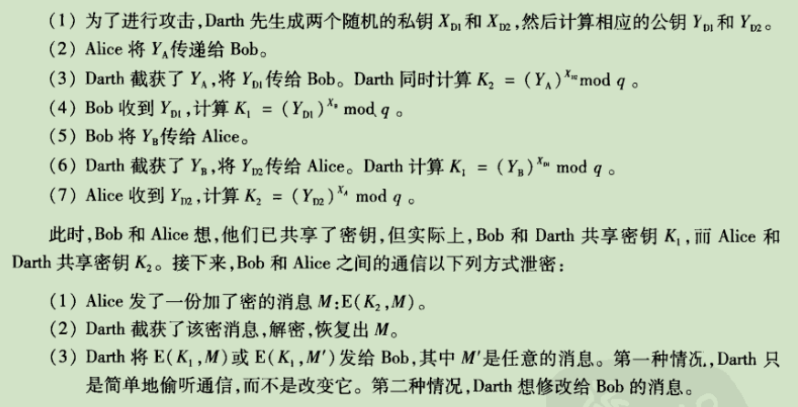

### http相关基础总结
---

#### HTTPS抓包分析

通过wireshark抓包可知该前三个数据帧为TCP三次握手，后四次为TLS握手过程（图中红圈部分）。
图解如下：

握手过程详细解释请参考：[http://wetest.qq.com/lab/view/110.html](http://wetest.qq.com/lab/view/110.html)

* TLS位于应用层和传输层之间，分为record protocol和handshake protocol。
* CA：受信任的数字证书颁发机构
* 证书：类似于身份证。x.509证书格式：

数字签名：证书拥有者用私钥对信息进行加密，由于私钥仅为本人所有，这样就生成了别人无法伪造的数据，该数据即数字签名。采用数字签名，能够确认以下两点：

（1）保证信息是由签名者所发送，签名者不能否认或者难以否认；

（2）保证信息自签发后到收到为止，未曾做过任何修改，签发的文件是真实的文件。
算法保证只有公钥才能解开私钥加密的信息。
* 安全性：

对公钥密码体制的要求：
* 产生一堆密钥在计算上是容易的
* 公钥加密、私钥解密在计算上是容易的
* 已知公钥要确定私钥在计算上是不可行的
* 已知公钥和密文要恢复明文在计算上是不可行的

RSA原理：选择质数p,q,计算n=p*q，φ(n)=(P-1)(Q-1)，选择d使得gcd(φ(n),d)=1;1<d<φ(n)。计算e使得de mod φ(n)=1 公钥为{d,n}，私钥{e,n}。加密：C=M^d(mod n)；解密：M=C^e(mod n)。其中M<n RSA安全性基于大数质因数分解的困难性。

中间人攻击：

#### http2.0

相比于1.x提升的几个方面：
* 多路复用
* 头部压缩（HPACK）
* 请求划分优先级
* 支持server push数据给客户端

HTTP2目前在实际使用中，只用于HTTPS协议场景下，通过握手阶段ClientHello与ServerHello的extension字段协商而来，所以目前HTTP2的使用场景，都是默认安全加密的。

reference：

[High Performance Browser Networking  |  O'Reilly](https://hpbn.co/http2/)

[https://www.zhihu.com/question/34074946](https://www.zhihu.com/question/34074946)