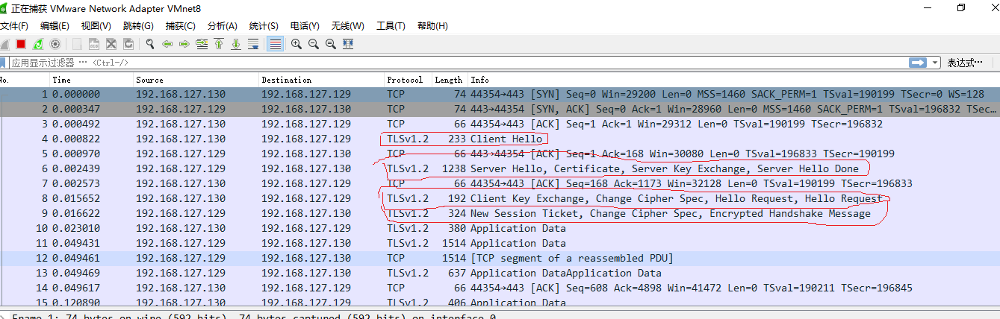
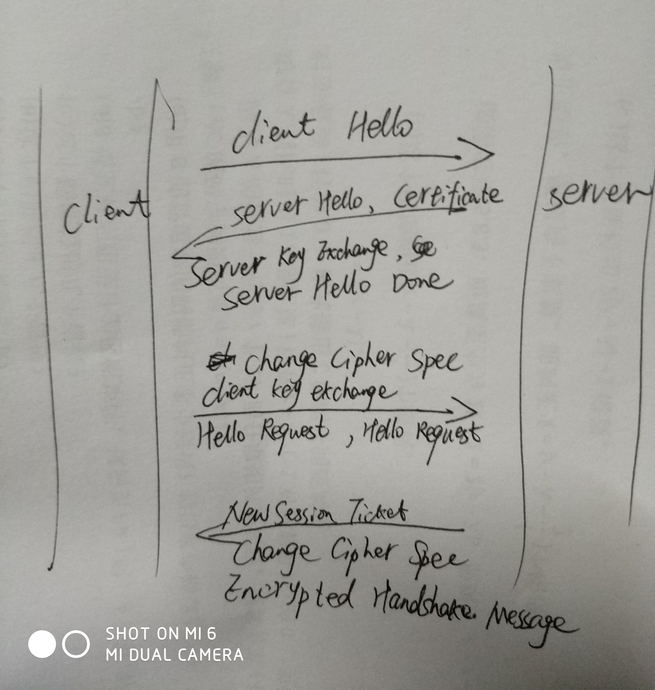
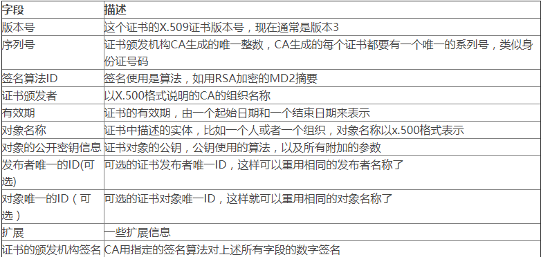
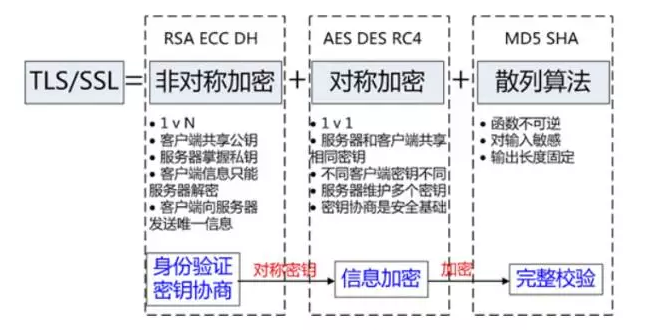

### http相关基础总结
---

#### HTTPS抓包分析

通过wireshark抓包可知该前三个数据帧为TCP三次握手，后四次为TLS握手过程（图中红圈部分）。
图解如下：

握手过程详细解释请参考：[http://wetest.qq.com/lab/view/110.html](http://wetest.qq.com/lab/view/110.html)

* TLS位于应用层和传输层之间，分为record protocol和handshake protocol。
* CA：受信任的数字证书颁发机构
* 证书：类似于身份证。x.509证书格式：

数字证书采用公开密钥加密体制，利用一个强关联的密钥对进行加、解密。证书拥有者保存好自己的私钥，用它进行解密和签名；并把公钥公开，供一组用户所共享，用于加密和验证签名。

1、加密：发送数据时，发送方使用接收方的公钥对数据加密，接收方用私钥解密，还原消息。算法保证公钥加密的数据只有对应的私钥才能解密。

2、数字签名：证书拥有者用私钥对信息进行加密，由于私钥仅为本人所有，这样就生成了别人无法伪造的数据，该数据即数字签名。采用数字签名，能够确认以下两点：

（1）保证信息是由签名者所发送，签名者不能否认或者难以否认；

（2）保证信息自签发后到收到为止，未曾做过任何修改，签发的文件是真实的文件。
算法保证只有公钥才能解开私钥加密的信息。
* 安全性：

#### http2.0