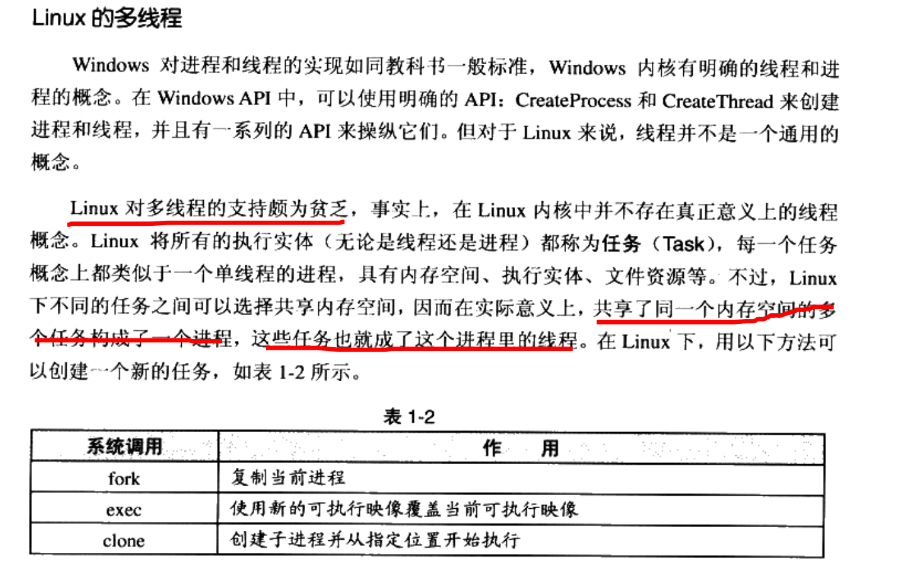
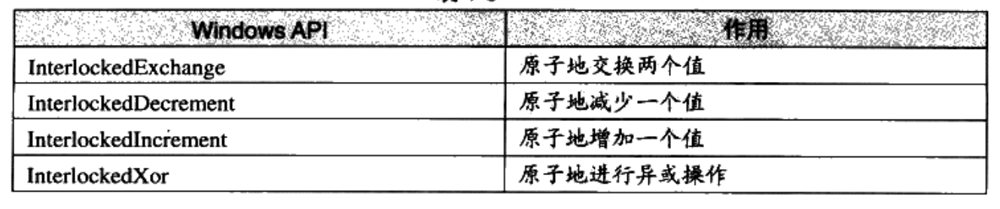
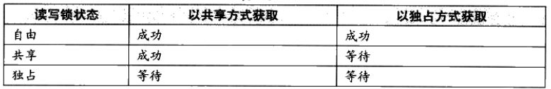

### 《程序员的自我修养：链接，装载和库》部分章节笔记
---
大二上看过一点，没怎么整理。

* chapter1：温故而知新

硬盘按同心圆分为多个磁道，每个磁道分1024个扇区（硬盘最小的存储单位），一个扇区含512字节。

一个标准的线程包括：线程ID，当前指令指针PC，堆栈，寄存器集合。

线 程 的 访 问 权 限 
线 程 的 访 问 非 常 自 由 ， 它 可 以 访 问 进 程 内 存 里 的 所 有 数 据 ， 甚 至 包 括 其 他 线 程 的 堆 栈 （ 如 
果 它 知 道 其 他 线 程 的 堆 栈 地 址 ， 那 么 这 就 是 很 少 见 的 情 况 ） ， 但 实 际 运 用 中 线 程 也 拥 有 自 己 
的 私 有 存 储 空 间 ， 包 括 以 下 几方面。 

* 栈 （ 尽 管 并 非 完 全 无 法 被 其 他 线 程 访 问 ， 但 一 般 情 况 下 仍 然 可 以 认 为 是 私 有 的 数 据 ） 。 
* 线 程 局 部 存 储 (Thread L storage, TLS)：线 程 局 部 存 储 是 某 些 操 作 系 统 为 线 程 单 独 
提 供 的 私 有 空 间 ， 但 通 常 只 具 有 很 有 限 的 容 量 。 
* 寄 存 器 （ 包 括pc寄 存 器 ） ， 寄 存 器 是 执 行 流 的 基 本 数 据 ， 因 此 为 线 程 私 有 。 
从 c 程 序 员 的 角 度 来 看 ， 数 据 在 线 程 之 间 是 否 私 有 如 下 所 示 。 

线 程 私 有： 
* 局 部 变 量 
* 函 数 的 参 数 
* TLS 数 据 

线 程 之 间 共 享 （ 进 程 所 有 ） ：
* 全 局 变 量 
* 堆 上 的 数 据 
* 函 数 里 的 静 态 变 量 
* 程 序 代 码 ， 任 何 线 程 都 有 权 利 读 取 并 执 行 任 何 代 码 
打 开 的 文 件 ， A 线 程 打 开 的 文 件 可 以 由 B 线 程 读 写 

主流调度方法都含有优先级调度，轮转法。

频繁等待的线程：IO密集型，如浏览器。

很少等待的：CPU密集型，如播放器。

Io密集型比CPU密集型更容易得到优先级提升。

为避免饿死现象（更容易因CPU密集型线程获得高优先级导致），等待很久没被执行的线程优先级会逐渐提升。

线程优先级改变方法：
* 1.用户指定
* 2.根据进入等待状态的频繁程度改变
* 3.久久不被执行而得到提升

单步执行的线程称为Atomic(原子的)，可保持多线程下共享的全局变量和堆栈数据等的一致性。

同步：一个线程访问数据还没结束时其他线程不得访问该数据。可实现数据访问的原子化。

同步的常用方法：锁。

Binary Semaphore:二元信号量，最简单的锁，只有占用和未占用两种状态。

对 于 允 许 多 个 线 程 并 发 访 问 的 资 源 ， 多 元 信 号 量 简 称 信 号 量。 一 个 初 始 值 为 N 的 信 号 量 允 许 N 个 线 程 并 发 访 问 。 线 程 访 问 资 源 的 时 候 首 癸 
获 取 信 号 量 ， 进 行 如 下 操 作 ： 
* 将 信 号 量 的 值 减 1
* 如 果 信 号 量 的 值 小 于 0 ， 则 进 入 等 待 状 态 ， 否 则 继 续 执 行 。 

访 问 完 资 源 之 后 ， 线 程 释 放 信 号 量 ， 进 行 如 下 操 作 ： 
* 将 信 号 量 的 值 加 1 。 
* 如 果 信 号 量 的 值 小 于 1 ， 唤 醒 一 个 等 待 中 的 线 程 。 

互斥量：类似于二元信号量，但是不同的是哪个线程获取了这个锁就要负责释放这个锁，保证资源只能被一个线程访问。而信号量中A 线程获取的锁可被B线程释放。

临界区：比互斥量更为严格，作用范围仅限于本线程，其他进程无法获取该锁。除此之外与互斥量性质相同。

读写锁：用于避免以上情况在读取频繁而写入较少时的低效。

条件变量：让多个线程一起等待某个事件发生

（函数）重入：

1.多个线程同时执行该函数。

2.该函数自身调用

可重入：被重入后不会有不良后果。即多线程安全

可重入函数的特点：
    * 不 使 用 任 何 〈 局 部 ） 静 态 或 全 局 的 非 const 变 量 · 
    * 不 返 回 任 何 〈 局 部 ） 静 态 或 全 局 的 非 const 变 量 的 指 针 。 
    * 仅 依 敕 于 调 用 方 提 供 的 参 数 。 
    * 不 依 賴 任 何 单 个 资 源 的 锁 (mutex 等 )
    * 不 调 用 任 何 不 可 重 入 的 函 数

* chapter 2: